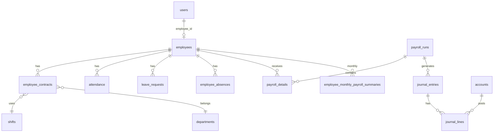

# ERB Payroll — Project Overview

> **تاريخ التوثيق:** يوليو 2026  
> **الغرض:** مرجع دائم لفريق التطوير يصف ما هو موجود فعليًا في الـ workspace (بدون افتراضات عن ميزات غير مُنفَّذة).

---

## جدول المحتويات

1. [البنية العامة للمشروع](#1-البنية-العامة-للمشروع)
2. [جداول قاعدة البيانات](#2-جداول-قاعدة-البيانات)
3. [الموديولز والميزات](#3-الموديولز-والميزات)
4. [واجهات الـ API](#4-واجهات-ال-api)
5. [الحضور والانصراف (Attendance)](#5-الحضور-والانصراف-attendance)
6. [ملاحظات تقنية ومشاكل محتملة](#6-ملاحظات-تقنية-ومشاكل-محتملة)

---

## 1. البنية العامة للمشروع

### 1.1 الـ Stack

| الطبقة | التقنية | المسار |
|--------|---------|--------|
| **Backend** | Node.js + TypeScript + Express 5 | `erb/` |
| **ORM** | Sequelize 6 | `erb/database/` |
| **Database** | PostgreSQL (Neon أو محلي عبر `DATABASE_URL`) | — |
| **Auth** | JWT (7 أيام) + bcrypt | `erb/src/modules/auth/` |
| **Validation** | Joi | كل موديول `*.validation.ts` |
| **Frontend** | Next.js 16 (App Router) + React 19 | `newerp/` |
| **Styling** | Tailwind CSS 4 | `newerp/app/globals.css` |
| **i18n** | next-intl (عربي/إنجليزي، افتراضي `ar`) | `newerp/messages/`, `i18n.ts` |
| **HTTP Client** | Axios | `newerp/lib/api.ts` |
| **State** | Zustand (lookup cache فقط) | `newerp/lib/store.ts` |
| **Forms** | react-hook-form + Zod 4 | `newerp/lib/validations/` |

### 1.2 هيكل الـ Workspace

```
ERB/                          ← جذر الـ workspace
├── erb/                      ← Backend API (port 5000)
│   ├── server.ts             ← نقطة الدخول
│   ├── database/
│   │   ├── db.connection.ts  ← اتصال Sequelize
│   │   ├── Models/           ← 31 نموذج Sequelize + relations.ts
│   │   └── scripts/          ← سكربتات seed/migration يدوية
│   └── src/
│       ├── modules/          ← 30 موديول (routes + controller + validation)
│       ├── service/          ← accounting, audit, email, leave
│       ├── events/           ← EventEmitter للمحاسبة والإشعارات
│       ├── middleware/       ← validation, errors, checkItemFound
│       └── utils/            ← apiFeatures, periodFilter, periodGuard, ...
├── newerp/                   ← Frontend (port 3000)
│   ├── app/
│   │   ├── [locale]/         ← كل الصفحات (en | ar)
│   │   │   ├── (auth)/       ← تسجيل دخول وكلمة مرور
│   │   └── (main)/           ← التطبيق مع Sidebar
│   │   └── api/auth/         ← login/logout (cookies)
│   ├── components/           ← UI مشترك + attendance + payroll + sidebar
│   ├── lib/                  ← services, permissions, hooks, utils
│   ├── messages/             ← ar.json, en.json
│   ├── proxy.ts              ← Auth + i18n (Next.js 16 proxy)
│   └── next.config.ts        ← rewrite /api/v1 → localhost:5000
└── scripts/                  ← سكربتات مساعدة على مستوى الـ workspace (إن وُجدت)
```

### 1.3 لماذا هذا التنظيم؟

| الجزء | الدور |
|-------|-------|
| `erb/src/modules/*` | كل domain له routes + controller + validation — نمط CRUD موحّد |
| `erb/database/Models` | تعريف الجداول والعلاقات في Sequelize |
| `erb/database/scripts` | لا يوجد مجلد migrations رسمي؛ التغييرات عبر سكربتات ts-node |
| `erb/src/service/accounting` | منطق القيود المحاسبية منفصل عن الـ controllers |
| `erb/src/events` | فصل إنشاء القيود والإشعارات عن مسار الطلب HTTP |
| `erb/src/modules/payroll_summary` | تجميع بيانات الشهر (حضور، إجازات، سلف) لحساب الرواتب |
| `newerp/lib/services` | طبقة API موحّدة (`createCrudService`) تتصل بالـ Backend |
| `newerp/lib/permissions.ts` | صلاحيات الواجهة (أدق من الـ Backend في بعض النقاط) |
| `newerp/proxy.ts` | حماية المسارات + توجيه اللغة قبل الوصول للصفحات |

### 1.4 التشغيل المحلي

| الخدمة | الأمر | المنفذ |
|--------|-------|--------|
| Backend | `cd erb && npm run dev` | `5000` |
| Frontend | `cd newerp && npm run dev` | `3000` |
| API من المتصفح | `NEXT_PUBLIC_API_URL=/api/v1` → rewrite إلى Backend | — |

**متغيرات بيئة أساسية (Backend):** `JWT_KEY`, `DATABASE_URL` (إلزامية). اختياري: `DB_SYNC`, `DB_SSL`, أكواد الحسابات المحاسبية، إعدادات البريد.

---

## 2. جداول قاعدة البيانات

> **ملاحظة:** أسماء الجداول الفعلية في PostgreSQL قد تختلف عن أسماء الملفات. الـ soft delete عبر `is_deleted` مستخدم في معظم الكيانات.

### 2.1 ملخص الجداول (31 جدول)

| # | الملف (Model) | اسم الجدول | الوظيفة |
|---|---------------|------------|---------|
| 1 | `user.model.ts` | `users` | مستخدمو النظام والأدوار |
| 2 | `employee.ts` | `employees` | بيانات الموظفين |
| 3 | `department.model.ts` | `departments` | الأقسام |
| 4 | `shift.model.ts` | `shifts` | الورديات وأيام العمل |
| 5 | `contracts.ts` | `employee_contracts` | عقود العمل |
| 6 | `contract_allowances.ts` | `contract_allowances` | بدلات العقد |
| 7 | `contract_leaves.ts` | `employee_leave_balances` | أرصدة إجازات العقد |
| 8 | `allowance_types.ts` | `allowances` | أنواع البدلات + كود حساب GL |
| 9 | `leaveType.model.ts` | `leave_types` | أنواع الإجازات |
| 10 | `leave_requests.ts` | `leave_requests` | طلبات الإجازة |
| 11 | `absence_type.ts` | `absence_types` | أنواع الغياب |
| 12 | `absences.ts` | `employee_absences` | سجلات الغياب |
| 13 | `attendance.ts` | `attendance` | الحضور والانصراف |
| 14 | `official_holiday.ts` | `holidays` | الإجازات الرسمية |
| 15 | `bonus_types.ts` | `bonus_types` | أنواع المكافآت |
| 16 | `employee_bonuses.ts` | `employee_bonuses` | مكافآت الموظفين |
| 17 | `employee_loans.ts` | `employee_advances_loans` | سلف وقروض |
| 18 | `employee_documents.ts` | `employee_documents` | مستندات الموظف |
| 19 | `employee_experience.ts` | `employee_experiences` | خبرات سابقة |
| 20 | `employee_relatives.ts` | `employee_contacts` | أقارب/جهات اتصال |
| 21 | `custody.ts` | `custody_transfers` | عهدة/أصول |
| 22 | `insurance_settings.ts` | `insurance_rates` | نسب التأمينات |
| 23 | `payroll_runs.ts` | `payroll_runs` | دورات الرواتب الشهرية |
| 24 | `payroll_details.ts` | `payroll_details` | تفاصيل راتب كل موظف في دورة |
| 25 | `employee_monthly_payroll_summary.ts` | `employee_monthly_payroll_summaries` | ملخص شهري مجمّع (حضور، إجازات، خصومات) |
| 26 | `Account.ts` | `accounts` | دليل الحسابات |
| 27 | `journal_entries.ts` | `journal_entries` | قيود اليومية |
| 28 | `journal_lines.ts` | `journal_lines` | بنود القيود |
| 29 | `accounting_periods.ts` | `accounting_periods` | الفترات المحاسبية (فتح/قفل) |
| 30 | `audit_logs.ts` | `audit_logs` | سجل التدقيق |

---

### 2.2 تفاصيل الأعمدة والعلاقات (حسب الموديلات)

#### `users`

| العمود | النوع | ملاحظات |
|--------|-------|---------|
| id | INTEGER PK | auto increment |
| name | STRING | |
| email | STRING | unique, nullable |
| password | STRING | bcrypt |
| uniqueCode | INTEGER | |
| isActive, isBlock, is_deleted | BOOLEAN | |
| confirmEmail | BOOLEAN | |
| role | ENUM | `SUPER-ADMIN`, `ADMIN`, `HR`, `ACCOUNTING`, `EMPLOYEE` |
| employee_id | INTEGER | FK → `employees.id`, unique, nullable |
| phoneNumber, code | STRING | |
| passwordChangedAt | DATE | لإبطال JWT القديم |
| passwordResetToken, resetCode, passwordResetTokenExpire | STRING/DATE | استعادة كلمة المرور |
| force_reset_password | BOOLEAN | إجبار تغيير كلمة المرور |
| createdAt, updatedAt | timestamps | |

**Indexes:** `createdAt`, `(is_deleted, isBlock)`, `role`, `name`  
**علاقات:** `belongsTo Employee`; `hasMany` Department (creator), AuditLog, AccountingPeriod

---

#### `employees`

| العمود | النوع | ملاحظات |
|--------|-------|---------|
| id | INTEGER PK | |
| code | STRING(20) | **unique** |
| full_name | STRING(200) | |
| birth_date | DATEONLY | |
| phone_number | STRING(20) | |
| gender | ENUM | M, F |
| national_id | STRING(14) | **unique** |
| email, address, qualification, bank_name, bank_account | optional | |
| marital_status | ENUM | single, married, divorced, widowed |
| department_id | INTEGER | |
| age | INTEGER | |
| is_deleted, is_active | BOOLEAN | |
| created_by, updated_by, deleted_by | INTEGER | |
| created_at + timestamps | DATE | |

**علاقات:** `hasOne User`; `hasMany` contracts, attendance, absences, loans, bonuses, payroll_details, leave_requests, documents, ...

---

#### `departments`

| العمود | النوع |
|--------|-------|
| id | INTEGER PK |
| parent_id | INTEGER nullable |
| name, type | STRING |
| created_by | INTEGER FK → users |
| create_at | DATE |
| isActive, is_deleted | BOOLEAN |

---

#### `shifts`

| العمود | النوع |
|--------|-------|
| id | INTEGER PK |
| name | STRING(100) |
| type | STRING |
| work_days | JSONB |
| start_time, end_time | TIME |
| grace_minutes | INTEGER (default 0) |
| deduct_grace | BOOLEAN |
| salary_basis_days | INTEGER (default 26) |
| is_deleted | BOOLEAN |

---

#### `employee_contracts`

| العمود | النوع |
|--------|-------|
| id | INTEGER PK |
| employee_id, department_id, shift_id | INTEGER |
| job_title | STRING(200) |
| start_date, end_date | DATEONLY |
| duration_years | INTEGER |
| base_salary | DECIMAL(12,2) |
| status | ENUM | active, suspended, resigned, dismissed |
| overtime_enabled | BOOLEAN |
| notes, attachment | TEXT/STRING |
| insurance_setting_id | INTEGER |
| created_by, updated_by | INTEGER |
| is_active, is_deleted | BOOLEAN |

---

#### `contract_allowances`

| العمود | النوع |
|--------|-------|
| id | INTEGER PK |
| contract_id, allowance_type_id | INTEGER |
| amount | DECIMAL(10,2) |
| is_deleted | BOOLEAN |

---

#### `employee_leave_balances`

| العمود | النوع |
|--------|-------|
| id | INTEGER PK |
| contract_id, leave_type_id | INTEGER |
| used_days | DECIMAL(5,1) |
| year | INTEGER |
| is_deleted | BOOLEAN |

---

#### `allowances` (أنواع البدلات)

| العمود | النوع |
|--------|-------|
| id | INTEGER PK |
| name | STRING(100) |
| default_amount | DECIMAL(10,2) |
| is_part_of_salary | BOOLEAN |
| account_code | STRING(20) | FK → `accounts.code` |
| is_deleted | BOOLEAN |

---

#### `leave_types`

| العمود | النوع |
|--------|-------|
| id | INTEGER PK |
| name | STRING(100) |
| annual_balance | INTEGER |
| affects_deduction | BOOLEAN |
| is_deleted | BOOLEAN |

---

#### `leave_requests`

| العمود | النوع |
|--------|-------|
| id | INTEGER PK |
| employee_id, leave_type_id | INTEGER |
| start_date, end_date | DATEONLY |
| days_count | DECIMAL(5,1) |
| status | ENUM | pending, approved, rejected |
| approved_by, rejected_by | INTEGER |
| reason | STRING |
| request_date | DATE |
| is_deleted | BOOLEAN |

---

#### `absence_types`

| العمود | النوع |
|--------|-------|
| id | INTEGER PK |
| name | STRING(100) |
| deduct_days | DECIMAL(3,1) |
| requires_permission | BOOLEAN |
| is_deleted | BOOLEAN |

---

#### `employee_absences`

| العمود | النوع |
|--------|-------|
| id | INTEGER PK |
| employee_id, absence_type_id | INTEGER |
| absence_date | DATEONLY |
| deduction_days | DECIMAL(3,1) |
| notes | TEXT |
| is_deleted | BOOLEAN |

---

#### `attendance` ⭐

| العمود | النوع |
|--------|-------|
| id | INTEGER PK |
| employee_id, department_id | INTEGER |
| work_date | DATEONLY |
| check_in, check_out | TIME nullable |
| late_hours | DECIMAL(6,2) default 0 |
| overtime_hours | DECIMAL(4,2) default 0 |
| working_hours | DECIMAL(4,2) default 0 |
| notes | TEXT |
| is_deleted | BOOLEAN |

**علاقات:** `belongsTo` Employee, Department

---

#### `holidays`

| العمود | النوع |
|--------|-------|
| id | INTEGER PK |
| name | STRING(100) |
| start_date | DATEONLY |
| days_count | INTEGER default 1 |
| is_deleted | BOOLEAN |

---

#### `bonus_types`

| العمود | النوع |
|--------|-------|
| id | INTEGER PK |
| name | STRING(100) |
| payment_type | ENUM | cash, deferred |
| default_amount | DECIMAL(10,2) |
| editable_amount | BOOLEAN |
| is_deleted | BOOLEAN |

---

#### `employee_bonuses`

| العمود | النوع |
|--------|-------|
| id | INTEGER PK |
| employee_id, bonus_type_id | INTEGER |
| amount | DECIMAL(10,2) |
| grant_date | DATEONLY |
| is_paid | BOOLEAN |
| payment_month, payment_year | INTEGER |
| approval_status | ENUM | pending, approved, rejected |
| approved_by, approved_at, rejection_reason | nullable |
| is_deleted | BOOLEAN |

---

#### `employee_advances_loans`

| العمود | النوع |
|--------|-------|
| id | INTEGER PK |
| employee_id | INTEGER |
| type | ENUM | advance, loan |
| amount | DECIMAL(12,2) |
| grant_date | DATEONLY |
| installment_amount | DECIMAL(10,2) |
| paid_amount | DECIMAL(12,2) |
| status | ENUM | active, settled |
| approval_status | ENUM | pending, approved, rejected |
| approved_by, approved_at, rejection_reason | nullable |
| is_deleted | BOOLEAN |

---

#### `employee_documents` / `employee_experiences` / `employee_contacts`

حقول مشتركة: `employee_id`, `is_deleted`, وبيانات خاصة بكل كيان (اسم الملف، الشركة، صلة القرابة، ...).

---

#### `custody_transfers`

| العمود | النوع |
|--------|-------|
| id | INTEGER PK |
| from_employee_id | INTEGER nullable |
| to_employee_id | INTEGER |
| item_name | STRING(300) |
| transfer_type | ENUM | handover, receive, transfer |
| transfer_date | DATEONLY |
| notes | TEXT |
| is_deleted | BOOLEAN |

---

#### `insurance_rates`

| العمود | النوع |
|--------|-------|
| id | INTEGER PK |
| employee_rate, company_rate | DECIMAL(5,2) |
| effective_from | DATEONLY |
| is_deleted | BOOLEAN |

---

#### `payroll_runs`

| العمود | النوع |
|--------|-------|
| id | INTEGER PK |
| month, year | INTEGER |
| status | ENUM | draft, confirmed, paid |
| processed_at, processed_by | nullable |
| created_by | INTEGER |
| is_deleted | BOOLEAN |

---

#### `payroll_details`

| العمود | النوع |
|--------|-------|
| id | INTEGER PK |
| payroll_run_id, employee_id | INTEGER |
| base_salary, overtime_pay, total_allowances, total_bonuses | DECIMAL |
| total_earnings | DECIMAL(12,2) |
| insurance_employee, insurance_company | DECIMAL |
| loan_deduction, absence_deduction, absence_days | DECIMAL |
| total_deductions, net_salary | DECIMAL(12,2) |
| is_deleted | BOOLEAN |

---

#### `employee_monthly_payroll_summaries`

| العمود | النوع |
|--------|-------|
| id | INTEGER PK |
| company_id, branch_id | INTEGER nullable (جاهزية multi-tenant) |
| employee_id, month, year | INTEGER |
| attended_days, absence_days, paid_leave_days, unpaid_leave_days | DECIMAL(5,2) |
| overtime_hours | DECIMAL(5,2) |
| total_bonus, total_allowances, total_deductions, loan_deductions | DECIMAL(10,2) |
| gross_salary, net_salary | DECIMAL nullable |
| version | INTEGER | optimistic locking |

**Indexes:** UNIQUE `(employee_id, month, year)` باسم `idx_emp_month_year`; indexes على `company_id`, `branch_id`  
**ملاحظة:** غير مربوط في `relations.ts` لكنه مستخدم في خدمات الرواتب.

---

#### `accounts`

| العمود | النوع |
|--------|-------|
| id | INTEGER PK |
| name, code | STRING (**code unique**) |
| type | ENUM | asset, liability, equity, revenue, expense |
| parent_id | INTEGER self-FK |
| level | INTEGER default 1 |
| is_posting | BOOLEAN |
| description | TEXT |
| currency | STRING default EGP |
| balance_type | ENUM | debit, credit |
| is_deleted | BOOLEAN |

**هرمية الحسابات:** `{ROOT}.{departmentId}.{employeeCode}` للحسابات الفرعية للموظفين.

---

#### `journal_entries`

| العمود | النوع |
|--------|-------|
| id | INTEGER PK |
| reference_type, reference_id | STRING/INTEGER |
| payroll_run_id | INTEGER FK nullable |
| entry_type | STRING(50) |
| posting_date | DATEONLY |
| description | TEXT |
| total_debit, total_credit | DECIMAL(14,2) |
| status | ENUM | draft, posted, cancelled |
| created_by | INTEGER FK → users |
| is_deleted | BOOLEAN |

---

#### `journal_lines`

| العمود | النوع |
|--------|-------|
| id | INTEGER PK |
| journal_entry_id | INTEGER FK CASCADE |
| account_id | INTEGER FK |
| account_code, account_name | STRING |
| debit, credit | DECIMAL(14,2) |
| description | TEXT |
| employee_id | INTEGER FK nullable |
| cost_center_id | INTEGER nullable |

---

#### `accounting_periods`

| العمود | النوع |
|--------|-------|
| id | INTEGER PK |
| month (1–12), year | INTEGER |
| status | ENUM | open, closed |
| closed_by, closed_at | nullable |
| created_by | INTEGER FK → users |
| is_deleted | BOOLEAN |

**Index:** UNIQUE `(month, year)` — `accounting_periods_month_year_unique`

---

#### `audit_logs`

| العمود | النوع |
|--------|-------|
| id | INTEGER PK |
| user_id | INTEGER FK nullable |
| user_name, user_role | STRING |
| action | ENUM | CREATE, UPDATE, DELETE, LOGIN, LOGOUT, APPROVE, REJECT |
| entity_type | STRING(100) |
| entity_id | INTEGER |
| old_values, new_values | JSONB |
| ip_address | STRING(50) |
| created_at | DATE (بدون Sequelize timestamps) |

---

### 2.3 مخطط علاقات مبسّط



---

## 3. الموديولز والميزات

### 3.1 قائمة الموديولز

| الموديول | Backend | Frontend | الوظيفة |
|----------|---------|----------|---------|
| **Auth** | ✅ | ✅ | تسجيل دخول (بريد أو موبايل مصري)، JWT، استعادة كلمة المرور |
| **Users** | ✅ | ✅ | إدارة مستخدمي النظام |
| **Employees** | ✅ | ✅ | CRUD موظفين + ربط حساب بوابة |
| **Employee Portal** | ✅ | ✅ | ملف شخصي، إجازات، سلف، QR حضور |
| **Departments** | ✅ | ✅ | الأقسام |
| **Shifts** | ✅ | ✅ | الورديات وأيام العمل |
| **Contracts** | ✅ | ✅ | عقود العمل |
| **Contract Allowances** | ✅ | ✅ | بدلات مرتبطة بالعقد |
| **Contract Leaves** | ✅ | ✅ | أرصدة إجازات العقد |
| **Documents / Relatives / Experience** | ✅ | ✅ | بيانات تكميلية للموظف |
| **Attendance** | ✅ | ✅ | حضور/انصراف + QR |
| **Leave Types & Requests** | ✅ | ✅ | إجازات وموافقات |
| **Absence Types & Records** | ✅ | ✅ | غياب وخصومات |
| **Official Holidays** | ✅ | ✅ | إجازات رسمية |
| **Loans & Bonuses** | ✅ | ✅ | سلف/قروض ومكافآت مع موافقة |
| **Custody** | ✅ | ✅ | عهدة أصول |
| **Insurance Settings** | ✅ | ✅ | نسب التأمين |
| **Payroll Runs & Details** | ✅ | ✅ | دورات رواتب شهرية |
| **Payroll Summary** | ✅ (خدمات) | — | تجميع شهري للحضور والخصومات |
| **Accounting (GL)** | ✅ | ✅ | دليل حسابات + قيود + فترات |
| **Reports** | ✅ | ✅ | تقارير تكلفة وخصومات وKPIs |
| **Audit Log** | ✅ | ✅ | سجل تدقيق |
| **Dashboard** | — | ✅ | لوحة تحكم حسب الدور |

**لا يوجد:** موديول مخزون (Inventory) أو فواتير مبيعات منفصلة — النظام **HR + Payroll + Accounting**.

---

### 3.2 Authentication & Authorization

#### Backend (مصدر الحقيقة للأمان)

| العنصر | التفاصيل |
|--------|----------|
| **الأدوار** | `SUPER-ADMIN`, `ADMIN`, `HR`, `ACCOUNTING`, `EMPLOYEE` |
| **التوكن** | JWT Bearer، صلاحية 7 أيام |
| **تسجيل الدخول** | `identifier` = بريد **أو** رقم مصري `01[0125]XXXXXXXX` |
| **Middleware** | `protectedRoutes` → `allowedTo(...roles)` أو `allowedToOrLinkedEmployee` |
| **بوابة الموظف** | `users.employee_id` يربط المستخدم بموظف؛ EMPLOYEE يصل لبياناته فقط |
| **قفل الفترة** | `assertPeriodOpen` / `assertPeriodOpenForDate` يمنع التعديل في شهر مقفول |

**لا يوجد جدول permissions** — الصلاحيات على مستوى الـ route فقط (RBAC خشن).

#### Frontend (طبقة عرض إضافية)

| العنصر | التفاصيل |
|--------|----------|
| **الملف** | `newerp/lib/permissions.ts` |
| **الدالة** | `can(role, permission)` |
| **الصلاحيات** | ~20 permission مثل `manage:attendance`, `read:payroll`, `read:ownAttendance` |
| **الحماية** | `RoleGuard` + فلترة قائمة `AppSidebar` |
| **الفرق عن Backend** | Frontend أدق (مثلاً `approve:loans` لـ ACCOUNTING)؛ يجب مواءمة أي تغيير |

#### تدفق المصادقة

```
المتصفح → POST /api/auth/login (Next.js)
        → POST /api/v1/auth/login (Express)
        → JWT + cookies (auth_token, force_reset)
        → proxy.ts يحمي المسارات
        → axios يرسل Authorization: Bearer
```

---

## 4. واجهات الـ API

**البادئة:** `/api/v1`  
**التسجيل:** `erb/src/modules/bootstrap.ts`

### 4.1 مسارات عامة (خارج /api/v1)

| Method | Path | الوظيفة |
|--------|------|---------|
| GET | `/` | رسالة ترحيب |
| GET | `/health` | فحص DB + إعداد البريد |

---

### 4.2 Auth — `/api/v1/auth`

| Method | Path | Auth | الوظيفة |
|--------|------|------|---------|
| POST | `/login` | عام | تسجيل دخول → JWT |
| POST | `/forgetPassword` | عام | إرسال كود استعادة |
| POST | `/verifyResetCode` | عام | التحقق من الكود |
| PATCH | `/resetPassword` | عام | تعيين كلمة مرور جديدة |
| PATCH | `/changePassword` | محمي | تغيير كلمة المرور |
| POST | `/logout` | محمي | تسجيل خروج + audit |

---

### 4.3 Users — `/api/v1/user`

| Method | Path | الأدوار | الوظيفة |
|--------|------|---------|---------|
| POST | `/` | SUPER-ADMIN, ADMIN | إنشاء مستخدم |
| GET | `/` | SUPER-ADMIN, ADMIN | قائمة المستخدمين |
| GET | `/:id` | SUPER-ADMIN, ADMIN | مستخدم واحد |
| POST | `/:id/resetPassword` | SUPER-ADMIN, ADMIN | إعادة تعيين كلمة المرور |
| PATCH | `/:id` | SUPER-ADMIN, ADMIN | تحديث |
| DELETE | `/:id` | SUPER-ADMIN, ADMIN | حذف منطقي |

---

### 4.4 الموارد البشرية

#### Employees — `/api/v1/employee`

| Method | Path | الوظيفة |
|--------|------|---------|
| GET | `/me` | ملف الموظف (EMPLOYEE) |
| GET | `/me/summary` | ملخص شهري (حضور، إجازات، راتب) |
| POST | `/` | إنشاء موظف |
| GET | `/` | قائمة |
| GET | `/:id` | تفاصيل |
| PATCH | `/:id` | تحديث |
| DELETE | `/:id` | حذف |
| POST | `/:id/create-user-account` | إنشاء حساب بوابة |
| POST | `/:id/reset-user-password` | إعادة تعيين كلمة مرور البوابة |

#### باقي كيانات HR (نمط CRUD موحّد: POST/GET `/`, GET/PATCH/DELETE `/:id`)

| المسار | الكيان |
|--------|--------|
| `/department` | الأقسام |
| `/shift` | الورديات |
| `/leaveType` | أنواع الإجازات |
| `/officialHoliday` | الإجازات الرسمية |
| `/employeeDocument` | مستندات |
| `/employeeRelative` | أقارب |
| `/employeeExperience` | خبرات |
| `/contract` | عقود |
| `/contractAllowance` | بدلات العقد |
| `/contractLeave` | أرصدة إجازات العقد |
| `/custody` | عهدة |
| `/absence` | سجلات غياب |
| `/leaveRequest` | طلبات إجازة (إنشاء للموظف المرتبط) |
| `/employeeLoan` | سلف/قروض |
| `/employeeBonus` | مكافآت |

#### Attendance — `/api/v1/attendance`

| Method | Path | الوظيفة |
|--------|------|---------|
| POST | `/` | مسح حضور/انصراف (auto أو check_in/check_out) |
| GET | `/` | قائمة مع فلتر فترة وبحث |
| GET | `/:id` | سجل واحد |
| PATCH | `/:id` | تصحيح يدوي |
| DELETE | `/:id` | حذف منطقي (toggle) |

---

### 4.5 الإعدادات المرجعية

| المسار | الكيان |
|--------|--------|
| `/allowanceType` | أنواع البدلات |
| `/absenceType` | أنواع الغياب |
| `/bonusType` | أنواع المكافآت |
| `/insuranceSettings` | إعدادات التأمين |

---

### 4.6 الرواتب — `/api/v1/payrollRun` و `/api/v1/payrollDetail`

| Method | Path | الوظيفة |
|--------|------|---------|
| POST | `/payrollRun` | إنشاء دورة (`auto_process` اختياري) |
| GET | `/payrollRun` | قائمة (فلتر month/year عبر periodFilter) |
| GET | `/payrollRun/:id` | دورة واحدة |
| PATCH | `/payrollRun/:id` | تحديث حالة (draft→confirmed→paid) |
| DELETE | `/payrollRun/:id` | حذف + عكس قيود |
| POST | `/payrollRun/:id/recalculate` | إعادة حساب (مسودة فقط) |
| GET | `/payrollDetail/:id` | كل تفاصيل دورة (`:id` = payroll_run_id) |
| GET | `/payrollDetail/:employee_id/:payroll_run_id` | كشف راتب موظف |

---

### 4.7 المحاسبة

| المسار | الوظيفة |
|--------|---------|
| `/account` | دليل الحسابات CRUD |
| `/journalEntry` | قيود اليومية CRUD |
| `/accountingPeriod` | فتح/قفل فترات محاسبية |

---

### 4.8 التقارير — `/api/v1/reports`

| Method | Path | الوظيفة |
|--------|------|---------|
| GET | `/payrollCost/:payroll_run_id` | تكلفة الرواتب |
| GET | `/loans` | تقرير السلف |
| GET | `/deductions/:payroll_run_id` | الخصومات |
| GET | `/kpis/:payroll_run_id` | مؤشرات شهرية |
| GET | `/yearly-kpis` | مؤشرات سنوية |
| GET | `/hr-stats` | إحصائيات HR للوحة التحكم |

---

### 4.9 التدقيق — `/api/v1/auditLog`

| Method | Path | الوظيفة |
|--------|------|---------|
| GET | `/` | استعلام سجل التدقيق (SUPER-ADMIN, ADMIN) |

---

### 4.10 أحداث النظام (Event-Driven)

| الحدث | المُطلِق | التأثير |
|-------|---------|---------|
| `LOAN_APPROVED` | قروض | قيد محاسبي + إشعار |
| `BONUS_APPROVED` | مكافآت | قيد محاسبي + إشعار |
| `PAYROLL_CONFIRMED` | رواتب | إشعار (القيود حسب مسار التأكيد) |
| `PAYROLL_DELETED` | رواتب | عكس القيود |
| `PAYROLL_PAID` | رواتب | إشعار قسائم للموظفين |
| `LEAVE_APPROVED/REJECTED` | إجازات | إشعار بريد |

---

## 5. الحضور والانصراف (Attendance)

> **الخلاصة:** الحضور **موجود ومكتمل نسبيًا** — ليس من الصفر. يشمل Backend + Frontend + تكامل مع الرواتب.

### 5.1 ما هو موجود

| الطبقة | الملفات / المسارات |
|--------|-------------------|
| **DB** | جدول `attendance` |
| **Backend** | `erb/src/modules/attendance/` (controller, routes, validation, time utils) |
| **Frontend Admin** | `newerp/app/[locale]/(main)/attendance/page.tsx` |
| **Frontend Employee** | `newerp/app/[locale]/(main)/my/attendance/page.tsx` |
| **QR** | `AttendanceQrScanner.tsx`, `EmployeeQrCard.tsx`, `employeeQr.ts` |
| **Live refresh** | `attendanceLive.ts`, `useAttendanceLiveRefresh.ts` (polling 5 ثوانٍ) |
| **Dashboard** | زر مسح QR سريع في الصفحة الرئيسية |

### 5.2 تدفق مسح الحضور (POST /attendance)

```
1. التحقق من أن الفترة المحاسبية للتاريخ مفتوحة
2. التحقق من وجود موظف + عقد active
3. تحميل وردية العقد (بداية/نهاية + فترة سماح)
4. إن لم يوجد سجل اليوم:
   - check_in: حساب late_hours، إنشاء سجل
   - رفض check_out بدون check_in
5. إن وُجد سجل بدون check_out:
   - check_out: حساب working_hours و overtime_hours
6. تحديث employee_monthly_payroll_summaries:
   - attended_days عند check_in
   - overtime_hours عند check_out
```

### 5.3 أعمدة الحضور المستخدمة

| العمود | الاستخدام |
|--------|-----------|
| work_date | تاريخ العمل |
| check_in / check_out | أوقات الحضور والانصراف |
| late_hours | تأخير (بعد فترة السماح) |
| overtime_hours | ساعات إضافية بعد نهاية الوردية |
| working_hours | ساعات العمل الفعلية |
| department_id | القسم وقت التسجيل |

### 5.4 التكامل مع الرواتب

- `PayrollAccumulatorService` يحدّث `employee_monthly_payroll_summaries` فور كل حضور/انصراف.
- عند إنشاء/إعادة حساب دورة رواتب، تُقرأ الملخصات الشهرية لبناء `payroll_details`.
- سكربت `fill-month-prep.ts` يملأ حضور شهر كامل للاختبار.

### 5.5 واجهة الموظف (QR)

- الموظف يفتح `/my/attendance` ويعرض QR يحتوي معرف الموظف.
- مسؤول HR يمسح من `/attendance` أو من لوحة التحكم.
- الـ payload يُبنى/يُفسَّر في `lib/utils/employeeQr.ts`.

### 5.6 ما الذي قد تحتاج بناءه أو توسيعه لاحقًا؟

| موجود | قد يُطوَّر |
|--------|-----------|
| check-in/out يدوي وQR | تطبيق موبايل مستقل |
| قائمة حضور + فلاتر | تقارير حضور متقدمة (تأخير شهري، خرائط حرارية) |
| ربط بالوردية | geofencing / أجهزة بصمة |
| تصحيح يدوي | workflow موافقات على التصحيح |
| تكامل رواتب | سياسات خصم تأخير تلقائي في الراتب (جزء منها في الغياب/الملخص) |

---

## 6. ملاحظات تقنية ومشاكل محتملة

### 6.1 البنية والتنظيم

| # | الملاحظة | التأثير |
|---|----------|---------|
| 1 | **لا يوجد مجلد migrations رسمي** — التغييرات عبر `database/scripts/*.ts` و`DB_SYNC` | صعوبة تتبع تاريخ الـ schema في بيئات متعددة |
| 2 | **`employee_monthly_payroll_summaries` غير في `relations.ts`** | علاقات Sequelize غير مكتملة في مكان واحد |
| 3 | **منطق Attendance كله في Controller** — لا service منفصل | صعوبة اختبار وحدة منفصلة |
| 4 | **توثيق قديم** (`erb/PROJECT_DOCUMENTATION.md`, `API_REFERENCE.md`) قد لا يطابق السلوك الحالي | مراجعة قبل الاعتماد عليه |
| 5 | **مجلد `newerp/app/i18n/`** (i18next قديم) غير مستخدم مع next-intl | تشتيت للمطورين الجدد |

### 6.2 Frontend

| # | الملاحظة |
|---|----------|
| 1 | **`lib/axios.ts` legacy** — الخدمات تستخدم `lib/api.ts`؛ axios القديم يحوّل دائمًا لـ `/ar/login` |
| 2 | **صلاحيات Frontend ≠ Backend** في بعض النقاط (مثلاً `approve:loans`) |
| 3 | **خطأ TypeScript** في `AttendanceQrScanner.tsx` (`working_hours` غير معرّف في نوع Entity) يمنع `npm run build` |
| 4 | **تعارض منافذ dev** — تشغيل أكثر من `next dev` يسبب 404/500 |
| 5 | **`@heroui/react` و `framer-motion`** في package.json دون استخدام فعلي |
| 6 | تحذيرات **Recharts** (عرض/ارتفاع -1) في لوحة التحكم |

### 6.3 Backend

| # | الملاحظة |
|---|----------|
| 1 | **RBAC خشن** — 5 أدوار فقط، لا ACL ديناميكي |
| 2 | **تأكيد الرواتب** — مسار التأكيد اليدوي يغيّر الحالة دون قيود محاسبية تلقائية (بعد تعديل سابق)؛ `auto_process` على الإنشاء يشغّل مسارًا أوسع |
| 3 | **شجرة الحسابات** — تأكيد رواتب مع محاسبة كاملة يتطلب `npm run setup:gl` وأكواد بدلات صحيحة |
| 4 | **`ApiFeatures`** يحذف `month`/`year` من الفلتر العام — يُعالج عبر `periodFilter` في controllers محددة |
| 5 | **بحث payroll** — `status` ENUM يحتاج cast لـ varchar في ILIKE |

### 6.4 قاعدة البيانات

| # | الملاحظة |
|---|----------|
| 1 | PostgreSQL عبر `DATABASE_URL` (غالبًا Neon مع SSL) |
| 2 | Soft delete منتشر — الاستعلامات يجب أن تفلتر `is_deleted` |
| 3 | UNIQUE على `(employee_id, month, year)` في الملخص الشهري |
| 4 | UNIQUE على `(month, year)` في الفترات المحاسبية |

### 6.5 سكربتات مساعدة (`erb/package.json`)

| الأمر | الوظيفة |
|-------|---------|
| `npm run seed` | بيانات تجريبية شاملة |
| `npm run setup:employees` | حسابات بوابة للموظفين |
| `npm run setup:gl` | دليل حسابات افتراضي |
| `npm run fill:month -- M Y` | تعبئة حضور/غياب/إجازات لشهر |
| `npm run provision:contract` | عقد لموظف بالبريد |

---

## ملحق: صفحات الواجهة (Frontend Routes)

جميع المسارات تحت `/{locale}/` حيث `locale ∈ {ar, en}`.

| المجموعة | أمثلة مسارات |
|----------|--------------|
| Auth | `/login`, `/forgot-password`, `/change-password` |
| Dashboard | `/` |
| HR | `/employees`, `/contracts`, `/attendance`, `/leave_requests` |
| Financial | `/employeeLoan`, `/employeeBonus`, `/custody` |
| Payroll | `/payroll`, `/payroll/[id]` |
| Accounting | `/account`, `/journalEntries`, `/accountingPeriods` |
| Settings | `/departments`, `/shifts`, `/leaveTypes`, ... |
| Employee | `/my/profile`, `/my/attendance`, `/my/leave-requests` |
| Admin | `/users`, `/auditLog` |

---

## ملحق: حسابات الدخول الافتراضية (بيئة التطوير)

| الدور | البريد | كلمة المرور (من السكربتات) |
|-------|--------|---------------------------|
| SUPER-ADMIN | `admin@company.com` | `01000000001` |

---

*نهاية التقرير — أي إضافة موديول جديد يُفضَّل البدء من مراجعة هذا الملف و`erb/src/modules/bootstrap.ts` و`newerp/lib/menu.ts`.*
