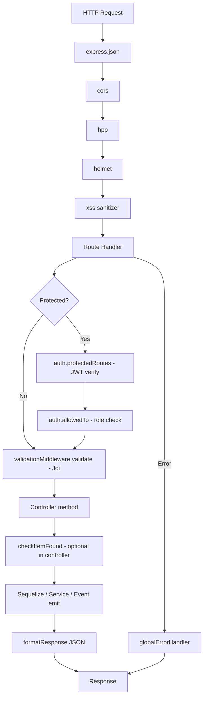
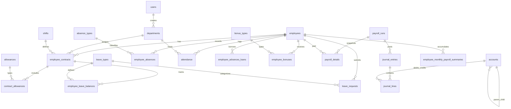
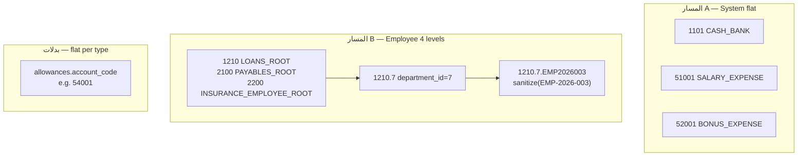

> **آخر تحديث:** 18 يونيو 2026  
> **الحالة:** تحليل كامل للكود المصدري  
> **تحذير:** هذا الملف مولّد من الكود الفعلي — أي تعديل يدوي قد يُفقد التزامن مع الكود

---

## جدول المحتويات

| # | القسم | الرابط |
|---|--------|--------|
| 1 | [نظرة عامة](#القسم-1--نظرة-عامة) | Stack، env، أوامر التشغيل، تسلسل البدء |
| 2 | [هيكل المشروع](#القسم-2--هيكل-المشروع) | شجرة الملفات، Request Flow |
| 3 | [قاعدة البيانات](#القسم-3--قاعدة-البيانات-بالتفصيل) | 28 جدولاً — أعمدة، ENUMs، indexes |
| 4 | [العلاقات](#القسم-4--العلاقات-بين-الجداول) | FK، Mermaid ER |
| 5 | [Business Logic](#القسم-5--business-logic) | 12 عملية رئيسية |
| 6 | [APIs الكاملة](#القسم-6--apis-الكاملة) | **138 endpoint** |
| 7 | [Authentication](#القسم-7--authentication--authorization) | JWT، Roles، مصفوفة صلاحيات |
| 8 | [Event System](#القسم-8--event-system) | 5 events |
| 9 | [Services & Utils](#القسم-9--services-وال-utils) | كل service/util |
| 10 | [Tech Debt](#القسم-10--tech-debt-والمشاكل-المعروفة) | مشاكل معروفة |
| 11 | [Quick Reference](#القسم-11--خريطة-المشروع-quick-reference) | 30 module |
| 12 | [المنطق المحاسبي](#القسم-12--المحاسبة) | شجرة الحسابات، القيود الستة، معادلة التحقق |
| 13 | [دليل التكامل للـ Frontend](#القسم-13--خريطة-الواجهة-frontend) | خريطة الشاشات، تسلسل الاستدعاءات، صلاحيات الـ UI |
| A | [ملحق Validation Schemas](#ملحق--validation-schemas-من-الكود) | 27 ملف validation |

**تحقق الأعداد:** جداول القسم 3 = **28** (Models في `database/Models/` باستثناء `relations.ts`) | Endpoints القسم 6 = **~142** (30 module في `bootstrap.ts`)

---

# القسم 1 — نظرة عامة

## اسم المشروع والهدف

| البند | القيمة |
|-------|--------|
| **اسم الحزمة** | `my-app` (package.json) |
| **النوع** | Backend API لنظام ERP (موارد بشرية + رواتب + محاسبة) |
| **اللغة** | TypeScript → Node.js / Express 5 |
| **قاعدة البيانات** | PostgreSQL عبر Sequelize 6 |
| **Base path** | `/api/v1` |
| **الوظائف الرئيسية** | إدارة موظفين، عقود، حضور، إجازات، غياب، سلف، مكافآت، دورات رواتب، قيود محاسبية، تقارير |

لا يوجد README رئيسي في الجذر؛ `README_DOCKER.md` يوثّق Docker فقط. `API_REFERENCE.md` مرجع API قديم منفصل.

## Stack الكامل (package.json)

### dependencies

| Package | الإصدار | الدور |
|---------|---------|-------|
| `express` | ^5.2.1 | إطار HTTP |
| `sequelize` | ^6.37.8 | ORM |
| `pg` | ^8.20.0 | PostgreSQL driver |
| `dotenv` | ^17.4.0 | تحميل `.env` |
| `jsonwebtoken` | ^9.0.3 | JWT auth |
| `bcrypt` | ^6.0.0 | تشفير كلمات المرور |
| `joi` | ^18.1.1 | Validation schemas |
| `nodemailer` | ^8.0.4 | إرسال email (reset password) |
| `cors` | ^2.8.6 | CORS |
| `helmet` | ^8.1.0 | Security headers |
| `hpp` | ^0.2.3 | HTTP Parameter Pollution protection |
| `express-xss-sanitizer` | ^2.0.2 | XSS sanitization |
| `xss` | ^1.0.15 | XSS filter (dependency of sanitizer) |
| `@types/express-xss-sanitizer` | ^2.0.0 | Types (مثبت كـ dependency) |
| `@types/hpp` | ^0.2.7 | Types (مثبت كـ dependency) |
| `@types/nodemailer` | ^8.0.0 | Types (مثبت كـ dependency) |

### devDependencies

| Package | الإصدار | الدور |
|---------|---------|-------|
| `typescript` | ^6.0.2 | Compiler |
| `ts-node-dev` | ^2.0.0 | Dev hot-reload |
| `@types/node` | ^25.5.0 | Node types |
| `@types/express` | ^5.0.6 | Express types |
| `@types/bcrypt` | ^6.0.0 | bcrypt types |
| `@types/jsonwebtoken` | ^9.0.10 | JWT types |
| `@types/cors` | ^2.8.19 | cors types |

## متغيرات البيئة

| المتغير | الغرض | إلزامي؟ | الافتراضي |
|---------|-------|---------|-----------|
| `JWT_KEY` | توقيع JWT | **نعم** — exit(1) | — |
| `DATABASE_URL` | PostgreSQL connection string | **نعم** — exit(1) | — |
| `PORT` | منفذ HTTP | لا | `5000` |
| `NODE_ENV` | بيئة التشغيل | لا | — (في development يُرجع stack trace) |
| `DB_SSL` | SSL لـ Postgres | لا | مفعّل إلا إذا `DB_SSL=false` |
| `DB_LOGGING` | Sequelize SQL log | لا | `false` |
| `ACCOUNT_CASH_BANK` | كود حساب الصندوق/البنك | لا | `1101` |
| `ACCOUNT_LOANS_ROOT` | جذر سلف الموظفين | لا | `1210` |
| `ACCOUNT_PAYABLES_ROOT` | جذر ذمم الموظفين | لا | `2100` |
| `ACCOUNT_SALARY_EXPENSE` | مصروف رواتب | لا | `51001` |
| `ACCOUNT_BONUS_EXPENSE` | مصروف مكافآت | لا | `52001` |
| `ACCOUNT_INSURANCE_EXPENSE` | مصروف تأمينات | لا | `53001` |
| `ACCOUNT_INSURANCE_COMPANY_PAYABLE` | تأمينات شركة مستحقة | لا | `22001` |
| `ACCOUNT_INSURANCE_EMPLOYEE_ROOT` | جذر تأمينات الموظف | لا | `2200` |
| `ACCOUNT_ABSENCE_REVENUE` | إيراد خصم غياب | لا | `41001` |
| `EMAIL_USER` | Gmail SMTP user | لا* | — |
| `EMAIL_PASS` | Gmail SMTP pass | لا* | — |

\* مطلوب عند تشغيل `forgetPassword` — يُرمى خطأ runtime إذا فشل الإرسال.

**ملاحظة:** `.env` موجود في `.gitignore` ولا يُ commit. `.env.example` هو المرجع.

## أوامر التشغيل

| الأمر | الوصف |
|-------|--------|
| `npm run dev` | `ts-node-dev --respawn --transpile-only server.ts` |
| `npm run build` | `tsc` → `dist/` |
| `npm start` | `node dist/server.js` |
| `npm test` | placeholder — exit 1 |
| `docker-compose up --build -d` | بناء وتشغيل container (من `README_DOCKER.md`) |
| `docker build -t erp-api .` | بناء image يدوياً |

## Docker

- **Dockerfile:** multi-stage (node:20-alpine)، build + production، user `nodeapp`، `EXPOSE 3000`
- **docker-compose.yml:** service `app`، ports `3000:3000`، `env_file: .env`
- **⚠️ تعارض منافذ:** `server.ts` default `PORT=5000`، Docker `EXPOSE 3000` — يجب `PORT=3000` في `.env` داخل Docker

## تسلسل بدء التشغيل (`server.ts`)

```
1. import relations.ts          → تسجيل Sequelize associations
2. import accounting.listeners  → تسجيل event listeners
3. dotenv.config()
4. تحقق JWT_KEY + DATABASE_URL → exit(1) إن ناقص
5. express app + middlewares:
   express.json → cors → hpp → helmet → xss → express.json (مكرر)
6. GET / و GET /health (static — لا يفحص DB فعلياً)
7. startServer() async:
   a. dataBase.connectionDB() → authenticate + sequelize.sync()
   b. bootstrap.mainBootstrap(app) → 28 route modules
   c. app.use(globalErrorHandler)
   d. listen(PORT) — fallback PORT+1 عند EADDRINUSE
```

---

# القسم 2 — هيكل المشروع

## شجرة الملفات الكاملة (150 ملف — بدون node_modules/dist/.git)

```
erb/
├── .dockerignore
├── .env                          (gitignored — موجود محلياً)
├── .env.example
├── .gitignore
├── .vscode/settings.json
├── API_REFERENCE.md
├── Dockerfile
├── PROJECT_DOCUMENTATION.md
├── README_DOCKER.md
├── check-locks.js
├── db-sync-test.ts
├── docker-compose.yml
├── openapi.yaml
├── package.json
├── package-lock.json
├── server.ts
├── tsconfig.json
├── database/
│   ├── db.connection.ts
│   └── Models/
│       ├── Account.ts
│       ├── absence_type.ts
│       ├── absences.ts
│       ├── allowance_types.ts
│       ├── attendance.ts
│       ├── bonus_types.ts
│       ├── contract_allowances.ts
│       ├── contract_leaves.ts
│       ├── contracts.ts
│       ├── custody.ts
│       ├── department.model.ts
│       ├── employee.ts
│       ├── employee_bonuses.ts
│       ├── employee_documents.ts
│       ├── employee_experience.ts
│       ├── employee_loans.ts
│       ├── employee_monthly_payroll_summary.ts
│       ├── employee_relatives.ts
│       ├── insurance_settings.ts
│       ├── journal_entries.ts
│       ├── journal_lines.ts
│       ├── leaveType.model.ts
│       ├── leave_requests.ts
│       ├── official_holiday.ts
│       ├── payroll_details.ts
│       ├── payroll_runs.ts
│       ├── relations.ts
│       ├── shift.model.ts
│       └── user.model.ts
├── scripts/
│   └── generate-project-docs.js  (مساعد توليد — ليس جزءاً من runtime)
└── src/
    ├── events/
    │   ├── accounting.listeners.ts
    │   └── eventEmitter.ts
    ├── middleware/
    │   ├── chickiItemFound.ts
    │   ├── globalErrorHandler.ts
    │   └── validation.ts
    ├── modules/
    │   ├── bootstrap.ts
    │   ├── absence_types/        (controller, routes, validation)
    │   ├── absences/
    │   ├── account/
    │   ├── allowance_types/
    │   ├── attendance/
    │   ├── auth/
    │   ├── bonus_types/
    │   ├── contract_allowances/
    │   ├── contract_leaves/
    │   ├── contracts/
    │   ├── custody/
    │   ├── department/
    │   ├── employee_bonuses/
    │   ├── employee_documents/
    │   ├── employee_experience/
    │   ├── employee_loans/
    │   ├── employee_relatives/
    │   ├── employees/
    │   ├── insurance_settings/
    │   ├── journal_entries/      (+ journalEntry.service.ts)
    │   ├── leave_requests/
    │   ├── leave_types/
    │   ├── official_holidays/
    │   ├── payroll_details/      (+ payroll_details.services.ts)
    │   ├── payroll_runs/
    │   ├── payroll_summary/      (accumulator, source, reconciliation services)
    │   ├── reports/              (+ reports.services.ts)
    │   ├── shift/
    │   └── user/
    ├── service/
    │   ├── accounting/
    │   │   ├── accountCodes.ts
    │   │   └── accountResolver.service.ts
    │   └── email/
    │       ├── emailTemplate.ts
    │       └── sendEmail.ts
    ├── types/
    │   └── express.d.ts
    └── utils/
        ├── apiFeatures.ts
        ├── appError.ts
        └── responseFormatter.ts
```

## وصف المجلدات

| المجلد | الدور |
|--------|-------|
| `database/` | Sequelize connection + Models |
| `database/Models/` | تعريف الجداول + `relations.ts` للعلاقات |
| `src/modules/` | 28 feature module (routes → controller → validation) |
| `src/modules/payroll_summary/` | Services داخلية (ليست routes) |
| `src/middleware/` | Validation Joi، error handler، existence check |
| `src/events/` | EventEmitter + accounting listeners |
| `src/service/` | Email + GL account resolution |
| `src/utils/` | ApiFeatures pagination، AppError، response envelope |

## نمط الـ Module

```
module/
├── {name}.routes.ts      → Router + auth + validation middleware
├── {name}.controller.ts  → HTTP handlers + checkItemFound + business logic
├── {name}.validation.ts  → Joi schemas
└── {name}.services.ts    → (اختياري) منطق معقد — payroll_details, reports, journalEntry
```

**تسجيل المسارات:** `src/modules/bootstrap.ts` → `app.use("/api/v1/{prefix}", router)`

## Request Flow



**ترتيب Middlewares في `server.ts`:** `json → cors → hpp → helmet → xss → json`  
**ترتيب Route-level:** `protectedRoutes → allowedTo → validate → controller`  
**Error handler:** بعد كل الـ routes في `startServer()`

---

# القسم 3 — قاعدة البيانات بالتفصيل

> **عدد الجداول: 28** — كل model في `database/Models/*.ts` ما عدا `relations.ts`  
> **ملاحظة عامة:** كل الـ models تستخدم `timestamps: true` → أعمدة `createdAt`, `updatedAt` ضمنية

## 3.1 `users` — User

| العمود | النوع | Nullable | Default | PK | Unique | Constraints |
|--------|-------|----------|---------|-----|--------|-------------|
| id | INTEGER | NO | auto | PK | | |
| name | STRING | NO | | | | len 1-255 |
| email | STRING | YES | | | YES | |
| password | STRING | NO | | | | |
| uniqueCode | INTEGER | YES | | | | |
| isActive | BOOLEAN | YES | true | | | |
| isBlock | BOOLEAN | YES | false | | | |
| is_deleted | BOOLEAN | YES | false | | | |
| confirmEmail | BOOLEAN | YES | false | | | |
| role | ENUM | YES | HR | | | SUPER-ADMIN, ADMIN, HR, ACCOUNTING |
| phoneNumber | STRING | YES | | | | |
| code | STRING | YES | | | | |
| passwordChangedAt | DATE | YES | | | | |
| passwordResetToken | STRING | YES | | | | |
| resetCode | STRING | YES | | | | |
| passwordResetTokenExpire | DATE | YES | | | | |

**Hooks:** `beforeCreate` → bcrypt hash password (cost 8)  
**Indexes:** `[createdAt]`, `[is_deleted, isBlock]`, `[role]`, `[name]`

---

## 3.2 `departments` — Department

| العمود | النوع | Nullable | Default | PK | Unique |
|--------|-------|----------|---------|-----|--------|
| id | INTEGER | NO | auto | PK | |
| parent_id | INTEGER | YES | | | |
| name | STRING | NO | | | |
| type | STRING | NO | | | |
| created_by | INTEGER | NO | | | |
| create_at | DATE | YES | | | |
| isActive | BOOLEAN | YES | true | | |
| is_deleted | BOOLEAN | YES | false | | |

---

## 3.3 `employees` — Employee

| العمود | النوع | Nullable | Default | PK | Unique |
|--------|-------|----------|---------|-----|--------|
| id | INTEGER | NO | auto | PK | |
| code | STRING(20) | NO | | | YES |
| full_name | STRING(200) | NO | | | |
| birth_date | DATEONLY | NO | | | |
| phone_number | STRING(20) | NO | | | |
| gender | ENUM(M,F) | NO | | | |
| national_id | STRING(14) | NO | | | YES |
| email | STRING(200) | YES | | | |
| address | TEXT | YES | | | |
| marital_status | ENUM | YES | | | single, married, divorced, widowed |
| qualification | STRING(200) | YES | | | |
| bank_name | STRING(100) | YES | | | |
| bank_account | STRING(50) | YES | | | |
| created_at | DATE | YES | NOW | | |
| is_deleted | BOOLEAN | YES | false | | |
| is_active | BOOLEAN | YES | true | | |
| created_by | INTEGER | NO | | | |
| updated_by | INTEGER | NO | | | |
| deleted_by | INTEGER | NO | | | |
| department_id | INTEGER | YES | | | |

---

## 3.4 `shifts` — Shift

| العمود | النوع | Nullable | Default | PK |
|--------|-------|----------|---------|-----|
| id | INTEGER | NO | auto | PK |
| name | STRING(100) | NO | | |
| type | STRING | NO | | |
| work_days | JSONB | NO | | |
| start_time | TIME | NO | | |
| end_time | TIME | NO | | |
| grace_minutes | INTEGER | YES | 0 | |
| deduct_grace | BOOLEAN | YES | false | |
| salary_basis_days | INTEGER | YES | 26 | |
| is_deleted | BOOLEAN | YES | false | |

---

## 3.5 `employee_contracts` — EmployeeContract

| العمود | النوع | Nullable | Default | PK |
|--------|-------|----------|---------|-----|
| id | INTEGER | NO | auto | PK |
| employee_id | INTEGER | NO | | |
| department_id | INTEGER | NO | | |
| job_title | STRING(200) | NO | | |
| start_date | DATEONLY | NO | | |
| duration_years | INTEGER | YES | | |
| end_date | DATEONLY | YES | | |
| base_salary | DECIMAL(12,2) | NO | | |
| shift_id | INTEGER | NO | | |
| status | ENUM | NO | | active, suspended, resigned, dismissed |
| overtime_enabled | BOOLEAN | YES | false | |
| notes | TEXT | YES | | |
| attachment | STRING(500) | YES | | |
| created_by | INTEGER | NO | | |
| updated_by | INTEGER | NO | | |
| is_active | BOOLEAN | YES | true | |
| is_deleted | BOOLEAN | YES | false | |
| insurance_setting_id | INTEGER | YES | | |

---

## 3.6 `allowances` — Allowance

| العمود | النوع | Nullable | Default | PK |
|--------|-------|----------|---------|-----|
| id | INTEGER | NO | auto | PK |
| name | STRING(100) | NO | | |
| default_amount | DECIMAL(10,2) | YES | 0 | |
| is_part_of_salary | BOOLEAN | YES | false | |
| account_code | STRING(20) | NO | | |
| is_deleted | BOOLEAN | YES | false | |

---

## 3.7 `contract_allowances` — ContractAllowance

| العمود | النوع | Nullable | Default | PK | Unique |
|--------|-------|----------|---------|-----|--------|
| id | INTEGER | NO | auto | PK | |
| contract_id | INTEGER | NO | | | |
| allowance_type_id | INTEGER | NO | | | |
| amount | DECIMAL(10,2) | NO | | | |
| is_deleted | BOOLEAN | YES | false | | |

## 3.8 `leave_types` — LeaveType

| العمود | النوع | Nullable | Default | PK |
|--------|-------|----------|---------|-----|
| id | INTEGER | NO | auto | PK |
| name | STRING(100) | NO | | |
| annual_balance | INTEGER | YES | 0 | |
| affects_deduction | BOOLEAN | YES | false | |
| is_deleted | BOOLEAN | YES | false | |

## 3.9 `employee_leave_balances` — EmployeeLeaveBalance

| العمود | النوع | Nullable | Default | PK |
|--------|-------|----------|---------|-----|
| id | INTEGER | NO | auto | PK |
| contract_id | INTEGER | NO | | |
| leave_type_id | INTEGER | NO | | |
| used_days | DECIMAL(5,1) | YES | 0 | |
| year | INTEGER | NO | | |
| is_deleted | BOOLEAN | YES | false | |

## 3.10 `leave_requests` — LeaveRequest

| العمود | النوع | Nullable | Default | PK |
|--------|-------|----------|---------|-----|
| id | INTEGER | NO | auto | PK |
| employee_id | INTEGER | NO | | |
| leave_type_id | INTEGER | NO | | |
| start_date | DATEONLY | NO | | |
| end_date | DATEONLY | NO | | |
| days_count | DECIMAL(5,1) | NO | | |
| status | ENUM(pending,approved,rejected) | NO | pending | |
| approved_by | INTEGER | YES | | |
| rejected_by | INTEGER | YES | | |
| reason | STRING | YES | | |
| request_date | DATE | YES | NOW | |
| is_deleted | BOOLEAN | YES | false | |

## 3.11 `absence_types` — AbsenceType

| العمود | النوع | Nullable | Default | PK |
|--------|-------|----------|---------|-----|
| id | INTEGER | NO | auto | PK |
| name | STRING(100) | NO | | |
| deduct_days | DECIMAL(3,1) | NO | | |
| requires_permission | BOOLEAN | YES | false | |
| is_deleted | BOOLEAN | YES | false | |

## 3.12 `employee_absences` — EmployeeAbsence

| العمود | النوع | Nullable | Default | PK |
|--------|-------|----------|---------|-----|
| id | INTEGER | NO | auto | PK |
| employee_id | INTEGER | NO | | |
| absence_type_id | INTEGER | NO | | |
| absence_date | DATEONLY | NO | | |
| deduction_days | DECIMAL(3,1) | NO | | |
| notes | TEXT | YES | | |
| is_deleted | BOOLEAN | YES | false | |

## 3.13 `attendance` — Attendance

| العمود | النوع | Nullable | Default | PK |
|--------|-------|----------|---------|-----|
| id | INTEGER | NO | auto | PK |
| employee_id | INTEGER | NO | | |
| department_id | INTEGER | NO | | |
| work_date | DATEONLY | NO | | |
| check_in | TIME | YES | | |
| check_out | TIME | YES | | |
| late_minutes | INTEGER | YES | 0 | |
| overtime_hours | DECIMAL(4,2) | YES | 0 | |
| working_hours | DECIMAL(4,2) | YES | 0 | |
| notes | TEXT | YES | | |
| is_deleted | BOOLEAN | YES | false | |

## 3.14 `bonus_types` — BonusType

| العمود | النوع | Nullable | Default | PK |
|--------|-------|----------|---------|-----|
| id | INTEGER | NO | auto | PK |
| name | STRING(100) | NO | | |
| payment_type | ENUM(cash,deferred) | NO | | |
| default_amount | DECIMAL(10,2) | YES | | |
| editable_amount | BOOLEAN | YES | true | |
| is_deleted | BOOLEAN | YES | false | |

## 3.15 `employee_bonuses` — EmployeeBonus

| العمود | النوع | Nullable | Default | PK |
|--------|-------|----------|---------|-----|
| id | INTEGER | NO | auto | PK |
| employee_id | INTEGER | NO | | |
| bonus_type_id | INTEGER | NO | | |
| amount | DECIMAL(10,2) | NO | | |
| grant_date | DATEONLY | NO | | |
| is_paid | BOOLEAN | YES | false | |
| payment_month | INTEGER | YES | | |
| payment_year | INTEGER | YES | | |
| is_deleted | BOOLEAN | YES | false | |

## 3.16 `employee_advances_loans` — EmployeeAdvanceLoan

| العمود | النوع | Nullable | Default | PK |
|--------|-------|----------|---------|-----|
| id | INTEGER | NO | auto | PK |
| employee_id | INTEGER | NO | | |
| type | ENUM(advance,loan) | NO | | |
| amount | DECIMAL(12,2) | NO | | |
| grant_date | DATEONLY | NO | | |
| installment_amount | DECIMAL(10,2) | YES | | |
| paid_amount | DECIMAL(12,2) | YES | 0 | |
| status | ENUM(active,settled) | NO | | |
| is_deleted | BOOLEAN | YES | false | |

## 3.17 `insurance_rates` — InsuranceRate

| العمود | النوع | Nullable | Default | PK |
|--------|-------|----------|---------|-----|
| id | INTEGER | NO | auto | PK |
| employee_rate | DECIMAL(5,2) | NO | | |
| company_rate | DECIMAL(5,2) | NO | | |
| effective_from | DATEONLY | NO | | |
| is_deleted | BOOLEAN | NO | false | |

## 3.18 `employee_monthly_payroll_summaries` — EmployeeMonthlyPayrollSummary

| العمود | النوع | Nullable | Default | PK | Unique |
|--------|-------|----------|---------|-----|--------|
| id | INTEGER | NO | auto | PK | |
| company_id | INTEGER | YES | | | |
| branch_id | INTEGER | YES | | | |
| employee_id | INTEGER | NO | | | composite |
| month | INTEGER | NO | | | composite |
| year | INTEGER | NO | | | composite |
| attended_days | DECIMAL(5,2) | YES | 0 | | |
| absence_days | DECIMAL(5,2) | YES | 0 | | |
| paid_leave_days | DECIMAL(5,2) | YES | 0 | | |
| unpaid_leave_days | DECIMAL(5,2) | YES | 0 | | |
| overtime_hours | DECIMAL(5,2) | YES | 0 | | |
| total_bonus | DECIMAL(10,2) | YES | 0 | | |
| total_allowances | DECIMAL(10,2) | YES | 0 | | |
| total_deductions | DECIMAL(10,2) | YES | 0 | | |
| loan_deductions | DECIMAL(10,2) | YES | 0 | | |
| gross_salary | DECIMAL(10,2) | YES | | | |
| net_salary | DECIMAL(10,2) | YES | | | |
| version | INTEGER | YES | 0 | | |

**Indexes:** UNIQUE(employee_id, month, year) | index(company_id) | index(branch_id) | **version: true**

## 3.19 `payroll_runs` — PayrollRun

| العمود | النوع | Nullable | Default | PK |
|--------|-------|----------|---------|-----|
| id | INTEGER | NO | auto | PK |
| month | INTEGER | NO | | |
| year | INTEGER | NO | | |
| status | ENUM(draft,confirmed,paid) | NO | draft | |
| processed_at | DATE | YES | | |
| processed_by | INTEGER | YES | | |
| is_deleted | BOOLEAN | YES | false | |
| created_by | INTEGER | YES | | |

## 3.20 `payroll_details` — PayrollDetail

| العمود | النوع | Nullable | Default | PK | FK onDelete |
|--------|-------|----------|---------|-----|-------------|
| id | INTEGER | NO | auto | PK | |
| payroll_run_id | INTEGER | NO | | | CASCADE |
| employee_id | INTEGER | NO | | | CASCADE |
| base_salary | DECIMAL(12,2) | NO | | | |
| overtime_pay | DECIMAL(10,2) | YES | 0 | | |
| total_allowances | DECIMAL(12,2) | YES | 0 | | |
| total_bonuses | DECIMAL(12,2) | YES | 0 | | |
| total_earnings | DECIMAL(12,2) | NO | | | |
| insurance_employee | DECIMAL(10,2) | YES | 0 | | |
| insurance_company | DECIMAL(10,2) | YES | 0 | | |
| loan_deduction | DECIMAL(10,2) | YES | 0 | | |
| absence_deduction | DECIMAL(10,2) | YES | 0 | | |
| absence_days | DECIMAL(5,2) | YES | 0 | | |
| total_deductions | DECIMAL(12,2) | NO | | | |
| net_salary | DECIMAL(12,2) | NO | | | |
| is_deleted | BOOLEAN | YES | false | | |

## 3.21 `accounts` — Account

| العمود | النوع | Nullable | Default | PK | Unique |
|--------|-------|----------|---------|-----|--------|
| id | INTEGER | NO | auto | PK | |
| name | STRING | NO | | | |
| code | STRING | NO | | | YES |
| type | ENUM(asset,liability,equity,revenue,expense) | NO | | | |
| parent_id | INTEGER | YES | | | |
| level | INTEGER | NO | 1 | | |
| is_posting | BOOLEAN | YES | false | | |
| description | TEXT | YES | | | |
| currency | STRING | YES | EGP | | |
| balance_type | ENUM(debit,credit) | NO | | | |
| is_deleted | BOOLEAN | YES | false | | |

## 3.22 `journal_entries` — JournalEntry

| العمود | النوع | Nullable | Default | PK | FK |
|--------|-------|----------|---------|-----|-----|
| id | INTEGER | NO | auto | PK | |
| reference_type | STRING(50) | YES | | | |
| reference_id | INTEGER | YES | | | |
| payroll_run_id | INTEGER | YES | | | SET NULL |
| entry_type | STRING(50) | NO | | | |
| posting_date | DATEONLY | NO | NOW | | |
| description | TEXT | NO | | | |
| total_debit | DECIMAL(14,2) | NO | | | |
| total_credit | DECIMAL(14,2) | NO | | | |
| status | ENUM(draft,posted,cancelled) | NO | posted | | |
| created_by | INTEGER | YES | | | SET NULL |
| is_deleted | BOOLEAN | NO | false | | |

## 3.23 `journal_lines` — JournalLine

| العمود | النوع | Nullable | Default | PK | FK |
|--------|-------|----------|---------|-----|-----|
| id | INTEGER | NO | auto | PK | |
| journal_entry_id | INTEGER | NO | | | CASCADE |
| account_id | INTEGER | NO | | | |
| account_code | STRING(20) | YES | | | |
| account_name | STRING(300) | YES | | | |
| debit | DECIMAL(14,2) | YES | 0 | | |
| credit | DECIMAL(14,2) | YES | 0 | | |
| description | TEXT | YES | | | |
| employee_id | INTEGER | YES | | | SET NULL |
| cost_center_id | INTEGER | YES | | | |

## 3.24 `employee_documents` — EmployeeDocument

| id PK | employee_id | doc_name STRING(200) | file_path STRING(500) | uploaded_at default NOW | is_deleted | employee_code STRING(200) nullable |

## 3.25 `employee_contacts` — EmployeeContact

| id PK | employee_id | relation STRING(50) | name STRING(200) | phone STRING(20) | is_deleted | employee_code nullable |

## 3.26 `employee_experiences` — EmployeeExperience

| id PK | employee_id | company_name | position nullable | from_date | to_date nullable | is_deleted | employee_code nullable |

## 3.27 `custody_transfers` — CustodyTransfer

| id PK | from_employee_id nullable | to_employee_id | item_name STRING(300) | transfer_type ENUM(handover,receive,transfer) | transfer_date | notes | is_deleted |

## 3.28 `holidays` — Holiday

| id PK | name STRING(100) | start_date DATEONLY | days_count default 1 | is_deleted |

**Hooks في كل الجداول:** لا يوجد except `users.beforeCreate` (bcrypt)  
**Scopes:** لا يوجد في أي model


## ملخص الجداول (28)

| المجموعة | الجداول | العدد |
|----------|---------|-------|
| Auth & Users | users | 1 |
| Organization | departments, shifts | 2 |
| HR Core | employees, employee_documents, employee_contacts, employee_experiences | 4 |
| Contracts | employee_contracts, contract_allowances, employee_leave_balances | 3 |
| Time & Attendance | attendance, leave_types, leave_requests, absence_types, employee_absences, holidays | 6 |
| Compensation | allowances, bonus_types, employee_bonuses, employee_advances_loans, insurance_rates, custody_transfers | 6 |
| Payroll | employee_monthly_payroll_summaries, payroll_runs, payroll_details | 3 |
| Accounting | accounts, journal_entries, journal_lines | 3 |
| **المجموع** | | **28** |

---

# القسم 4 — العلاقات بين الجداول

## جدول العلاقات (من `relations.ts` + FK في Models)

| من | إلى | النوع | FK | onDelete (DB-level) |
|----|-----|-------|-----|---------------------|
| User | Department | 1:N | created_by | logical |
| Department | User | N:1 | created_by | logical |
| Account | Account | self 1:N | parent_id | logical |
| Employee | EmployeeDocument | 1:N | employee_id | logical |
| Employee | EmployeeContact | 1:N | employee_id | logical |
| Employee | EmployeeExperience | 1:N | employee_id | logical |
| Employee | EmployeeContract | 1:N | employee_id | logical |
| Department | EmployeeContract | 1:N | department_id | logical |
| Shift | EmployeeContract | 1:N | shift_id | logical |
| EmployeeContract | User | N:1 | created_by, updated_by | logical |
| EmployeeContract | InsuranceRate | N:1 | insurance_setting_id | logical |
| EmployeeContract | ContractAllowance | 1:N | contract_id | logical |
| Allowance | ContractAllowance | 1:N | allowance_type_id | logical |
| EmployeeContract | EmployeeLeaveBalance | 1:N | contract_id | logical |
| LeaveType | EmployeeLeaveBalance | 1:N | leave_type_id | logical |
| PayrollRun | PayrollDetail | 1:N | payroll_run_id | **CASCADE** |
| Employee | PayrollDetail | 1:N | employee_id | **CASCADE** |
| PayrollRun | JournalEntry | 1:N | payroll_run_id | **SET NULL** |
| Department | Employee | 1:N | department_id | logical |
| JournalEntry | JournalLine | 1:N | journal_entry_id | **CASCADE** |
| JournalLine | Account | N:1 | account_id | logical |
| JournalLine | Employee | N:1 | employee_id | **SET NULL** |
| Employee | LeaveRequest | 1:N | employee_id | logical |
| LeaveType | LeaveRequest | 1:N | leave_type_id | logical |
| Employee | EmployeeAbsence | 1:N | employee_id | logical |
| AbsenceType | EmployeeAbsence | 1:N | absence_type_id | logical |
| Employee | Attendance | 1:N | employee_id | logical |
| Department | Attendance | 1:N | department_id | logical |
| Employee | EmployeeAdvanceLoan | 1:N | employee_id | logical |
| Employee | EmployeeBonus | 1:N | employee_id | logical |
| BonusType | EmployeeBonus | 1:N | bonus_type_id | logical |
| Employee | CustodyTransfer | 1:N (from/to) | from_employee_id, to_employee_id | logical |
| EmployeeMonthlyPayrollSummary | Employee | N:1 | employee_id | **DB FK** في model |
| Holiday | — | — | — | **لا associations** |

**⚠️ تعارض:** `relations.ts` يربط `Account ↔ Allowance` بـ `account_id` بينما model `Allowance` يعرّف `account_code` فقط — العلاقة logical قد لا تطابق DB.

## DB-level FK vs Logical

| DB-level (في model init) | Logical فقط (relations.ts) |
|--------------------------|----------------------------|
| payroll_details → payroll_runs, employees | معظم علاقات HR |
| journal_lines → journal_entries, accounts, employees | User ↔ Department |
| journal_entries → payroll_runs, users | Employee ↔ Attendance |
| employee_monthly_payroll_summaries → employees | Contract ↔ Shift |

## ER Diagram (Mermaid)



---

# القسم 5 — Business Logic

## 5.1 تسجيل الدخول

**Endpoint:** `POST /api/v1/auth/login`

1. Joi: `identifier` (required), `password` (min 6)
2. Controller يتحقق: email regex أو Egyptian phone `01[0125]xxxxxxxx`
3. `User.findOne` by email or phoneNumber
4. `bcrypt.compare` — 401 generic message
5. Reject if `!isActive` → 403
6. JWT sign 7d: `{ userId, role, name, isActive, uniqueCode }`
7. Response: `{ token, user: { id, name, role } }`

**Edge cases:** identifier غير email ولا phone → 400

---

## 5.2 استعادة كلمة المرور

| Step | Endpoint | Logic |
|------|----------|-------|
| 1 | `POST /auth/forgetPassword` | 6-digit code → `passwordResetToken` + 10min expiry → email |
| 2 | `POST /auth/verifyResetCode` | match token + not expired → set `resetCode` |
| 3 | `PATCH /auth/resetPassword` | require `resetCode` → hash password → clear tokens → JWT 1d |

**Side effect:** `sendEmail` via Gmail SMTP

---

## 5.3 إنشاء مستخدم

**Endpoint:** `POST /api/v1/user/`

1. Joi: name, email (TLD restricted), phoneNumber (Egyptian), role optional
2. Random 6-digit `uniqueCode`
3. **`password = phoneNumber` plaintext** (User model `beforeCreate` hashes it)
4. Return 201

---

## 5.4 إنشاء موظف كامل (multi-step)

لا endpoint واحد — التسلسل:

```
POST /employee          → employee record
POST /contract          → active contract (assertNoOtherActiveContract)
POST /contractAllowance → بدلات (×N)
POST /contractLeave     → رصيد إجازات per leave type + year
```

**Contract rules:** status=active → max one active contract per employee  
**Side effects:** none until attendance/leaves

---

## 5.5 Smart Check-in/out

**Endpoint:** `POST /api/v1/attendance/`

```
1. Verify employee exists
2. Find contract status=active, is_deleted=false → department_id, shift
3. No record for (employee, work_date):
   → CREATE check_in (body or now)
   → PayrollAccumulatorService.incrementAttendedDays(+1)
   → 201 "Check-in recorded"
4. Record exists, no check_out:
   → Compute late_minutes vs shift.start - grace
   → Compute working_hours, overtime_hours vs shift.end
   → Save check_out
   → If overtime > 0: incrementOvertime
   → 200 "Check-out recorded"
5. Already checked out → 400
```

**Update/Delete:** `reconcileSummaryChange` يعدّل attended_days و overtime_hours في summary

---

## 5.6 طلب الإجازة

**Endpoint:** `POST /api/v1/leaveRequest/`

**Transaction:**
1. Verify employee + leave type
2. If status=approved: deduct `EmployeeLeaveBalance.used_days` (check annual_balance)
3. Sync paid leave accumulator for start_date month/year
4. Create request

**Update status transitions:**

| Transition | Balance | Summary |
|------------|---------|---------|
| → approved | deduct days | +paid_leave_days |
| approved → other | restore | −paid_leave_days |
| approved + days_count change | delta adjust | delta paid leave |

**Events:** none

---

## 5.7 تسجيل الغياب

**Endpoint:** `POST /api/v1/absence/`

1. Verify employee + absence_type
2. Create with `deduction_days`
3. **No accumulator update at write time**
4. Picked up at payroll via `PayrollSourceService` (sum deduction_days in month)

---

## 5.8 سلفة/قرض

**Endpoint:** `POST /api/v1/employeeLoan/`

**Transaction:**
1. Create loan
2. `calculateLoanMonthlyDeduction`: advance=full remaining, loan=min(installment, remaining)
3. If deduction > 0 → `incrementLoanDeduction` for grant month
4. Commit → **`emit LOAN_CREATED`**

**Accounting listener:** Dr employee loans / Cr cash-bank

---

## 5.9 مكافأة

**Endpoint:** `POST /api/v1/employeeBonus/`

1. Create bonus
2. Commit → **`emit BONUS_CREATED`**

**Accounting:** cash → Dr bonus expense / Cr cash; deferred → Cr payables  
**Payroll:** unpaid bonuses with matching payment_month/year via PayrollSourceService

---

## 5.10 دورة الرواتب الكاملة

```
POST /payrollRun { month, year, auto_process=true }
  → Create run (draft)
  → generateForAllEmployeesBulk
  → Update status=confirmed, processed_at/by
  → emit PAYROLL_CONFIRMED

PATCH /payrollRun/:id { status: "paid" }
  → emit PAYROLL_PAID (no listener)

DELETE /payrollRun/:id (soft)
  → emit PAYROLL_DELETED → reversal JEs
```

**Recalculate:** `POST /payrollRun/:id/recalculate` — only if draft, delete details + regenerate

---

## 5.11 معادلات حساب الراتب (`payroll_details.services.ts`)

| المتغير | المعادلة | المصدر |
|---------|----------|--------|
| `salaryBasisDays` | shift.salary_basis_days \|\| 26 | Shift model |
| `dailyRate` | base_salary / salaryBasisDays | Contract |
| `overtime_pay` | (dailyRate / 8) × 1.5 × overtime_hours | Summary.overtime_hours |
| `total_allowances` | sum contract allowances | PayrollSourceService |
| `total_bonuses` | unpaid bonuses for month/year | PayrollSourceService |
| `total_earnings` | base + overtime + allowances + bonuses | calculated |
| `absence_days` | sum deduction_days in month | PayrollSourceService |
| `absence_deduction` | dailyRate × absence_days | calculated |
| `insurance_employee` | base_salary × employee_rate% | InsuranceRate (latest ≤ month end) |
| `insurance_company` | base_salary × company_rate% | InsuranceRate |
| `mandatory_deductions` | insurance_employee + absence_deduction | calculated |
| `loan_deduction` | min(source.loans, total_earnings - mandatory) | capped |
| `total_deductions` | mandatory + loan_deduction | calculated |
| `net_salary` | max(0, total_earnings - total_deductions) | calculated |

---

## 5.12 التقارير

| Report | Endpoint | مصدر البيانات |
|--------|----------|---------------|
| Payroll cost | `GET /reports/payrollCost/:id` | payroll_details grouped by department |
| Loans | `GET /reports/loans` | employee_advances_loans status=active |
| Deductions | `GET /reports/deductions/:id` | sum absence_deduction + loan_deduction |
| Monthly KPIs | `GET /reports/kpis/:id` | payroll_details — attendance % (26-day basis) |
| Yearly KPIs | `GET /reports/yearly-kpis` | all payroll_details aggregated |

---

# القسم 6 — APIs الكاملة

## إعدادات عامة

| البند | القيمة |
|-------|--------|
| **Base URL** | `http://localhost:5000/api/v1` (default PORT) |
| **Authorization** | `Authorization: Bearer <JWT>` |
| **Success envelope** | `{ meta: { status, success: true, message, pagination? }, data }` |
| **Error envelope** | `{ meta: { status, success: false }, error: { message, context? } }` |

### Pagination (GET list — ApiFeatures)

| Query | Default | الوصف |
|-------|---------|-------|
| `page` | 1 | رقم الصفحة |
| `limit` | 20 | عدد الس records |
| `sort` | — | `date` → createdAt DESC; `name` → ASC; أو `field1,field2` |
| `fields` | — | comma-separated exclude fields |
| `keyword` | — | iLike search على searchFields المحددة في controller |
| `{field}` | — | filter مباشر على أي عمود |
| `{field}[gt\|gte\|lt\|lte]` | — | operators |

### Error codes شائعة

| Code | المعنى |
|------|--------|
| 400 | Joi validation / business rule / Sequelize constraint |
| 401 | Missing/invalid JWT / wrong password |
| 403 | Role denied / account disabled |
| 404 | checkItemFound / resource not found |
| 500 | Unhandled / payroll auto_process failure |

---

## 6.1 Auth (5 endpoints)

### POST `/auth/login`
**Auth:** Public | **Validation:** signin

```json
{ "identifier": "string — required — email or 01xxxxxxxxx", "password": "string — required — min 6" }
```

**Success 200:**
```json
{ "meta": { "status": 200, "success": true, "message": "Logged in successfully" }, "data": { "token": "...", "user": { "id": 1, "name": "...", "role": "HR" } } }
```

### POST `/auth/forgetPassword` — `{ "email": "required email" }`
### POST `/auth/verifyResetCode` — `{ "code": "required 6 digits" }`
### PATCH `/auth/resetPassword` — `{ "email": "required", "newPassword": "min 6" }`
### PATCH `/auth/changePassword` — JWT — `{ "password": "required", "newPassword": "min 6" }`

---

## 6.2 User (5) — Roles: SUPER-ADMIN, ADMIN only

### POST `/user/`
```json
{ "name": "string min 3 — required", "email": "professional TLD — required", "phoneNumber": "Egyptian mobile — required", "role": "SUPER-ADMIN|ADMIN|HR|ACCOUNTING — optional" }
```
**Note:** password = phoneNumber (hashed by model hook)

### GET `/user/` — list with pagination
### GET/PATCH/DELETE `/user/:id` — standard CRUD + soft delete toggles is_deleted/isActive

---

## 6.3–6.27 CRUD Modules (5 endpoints each — 125 endpoints)

**Pattern مشترك** لـ: department, shift, leaveType, officialHoliday, account, allowanceType, absenceType, bonusType, insuranceSettings, employee, employeeDocument, employeeRelative, employeeExperience, contract, contractAllowance, contractLeave, custody, employeeLoan, employeeBonus, absence, leaveRequest, attendance, journalEntry

| Method | Path | Write Roles | Read Roles |
|--------|------|-------------|------------|
| POST | `/` | SUPER-ADMIN, ADMIN, HR | — |
| GET | `/` | — | + ACCOUNTING |
| GET | `/:id` | — | + ACCOUNTING |
| PATCH | `/:id` | SUPER-ADMIN, ADMIN, HR | — |
| DELETE | `/:id` | SUPER-ADMIN, ADMIN, HR | soft toggle |

**Validation schemas:** راجع `{module}.validation.ts` — كل create/update/idParam موثّق في Joi.

### Schemas خاصة (non-CRUD fields):

**contract create:**
```json
{ "employee_id": "number req", "department_id": "req", "shift_id": "req", "job_title": "req", "start_date": "ISO req", "base_salary": "positive req", "status": "active|suspended|resigned|dismissed req", "insurance_setting_id": "number req nullable" }
```

**leaveRequest create:**
```json
{ "employee_id": "req", "leave_type_id": "req", "start_date": "req", "end_date": "req", "days_count": "req min 0", "status": "pending|approved|rejected opt" }
```

**attendance create (Smart):**
```json
{ "employee_id": "req", "work_date": "ISO req", "check_in": "opt", "check_out": "opt", "notes": "opt" }
```

**journalEntry create:**
```json
{ "entry_type": "req", "description": "req", "lines": "array min 2 — each: account_id req, debit/credit min 0", "payroll_run_id": "opt", "posting_date": "opt", "status": "draft|posted|cancelled opt" }
```

**journalEntry PATCH status:**
```json
{ "status": "draft|posted|cancelled — required" }
```

---

## 6.28 Payroll Runs (6 endpoints)

### POST `/payrollRun/`
**Roles:** SUPER-ADMIN, ADMIN, ACCOUNTING

```json
{ "month": "1-12 req", "year": "2000-2100 req", "status": "draft|confirmed|paid opt", "auto_process": "boolean opt default true — NOT in Joi" }
```

**Success 201:** `{ payrollRun, processResult: { processed[], skipped[], errors[] } }`  
**Note:** auto_process=true → bulk calc → confirmed → PAYROLL_CONFIRMED; failure destroys run

### POST `/payrollRun/:id/recalculate` — draft only
### PATCH `/payrollRun/:id` — status flow draft→confirmed→paid; is_deleted→PAYROLL_DELETED

---

## 6.29 Payroll Details (2 endpoints)

### GET `/payrollDetail/:id` — `:id` = payroll_run_id → full run report
### GET `/payrollDetail/:employee_id/:payroll_run_id` — single employee breakdown

**No Joi validation** — manual NaN checks in controller

---

## 6.30 Reports (5 endpoints) — No validation

| Method | Path | Description |
|--------|------|-------------|
| GET | `/reports/payrollCost/:payroll_run_id` | Cost by department |
| GET | `/reports/loans` | Active loans remaining |
| GET | `/reports/deductions/:payroll_run_id` | Deduction analysis |
| GET | `/reports/kpis/:payroll_run_id` | Monthly KPIs |
| GET | `/reports/yearly-kpis` | Yearly KPIs |

---

## Endpoint Catalog (138 total)

| # | Method | Route | Auth |
|---|--------|-------|------|
| 1 | POST | /api/v1/auth/login | Public |
| 2 | POST | /api/v1/auth/forgetPassword | Public |
| 3 | POST | /api/v1/auth/verifyResetCode | Public |
| 4 | PATCH | /api/v1/auth/resetPassword | Public |
| 5 | PATCH | /api/v1/auth/changePassword | JWT |
| 6-10 | CRUD | /api/v1/user/* | SUPER-ADMIN, ADMIN |
| 11-15 | CRUD | /api/v1/department/* | HR write / +ACCOUNTING read |
| 16-20 | CRUD | /api/v1/shift/* | HR write |
| 21-25 | CRUD | /api/v1/leaveType/* | HR write |
| 26-30 | CRUD | /api/v1/officialHoliday/* | HR write |
| 31-35 | CRUD | /api/v1/account/* | HR write |
| 36-40 | CRUD | /api/v1/allowanceType/* | HR write |
| 41-45 | CRUD | /api/v1/absenceType/* | HR write |
| 46-50 | CRUD | /api/v1/bonusType/* | HR write |
| 51-55 | CRUD | /api/v1/insuranceSettings/* | HR write |
| 56-60 | CRUD | /api/v1/employee/* | HR write |
| 61-65 | CRUD | /api/v1/employeeDocument/* | HR write |
| 66-70 | CRUD | /api/v1/employeeRelative/* | HR write |
| 71-75 | CRUD | /api/v1/employeeExperience/* | HR write |
| 76-80 | CRUD | /api/v1/contract/* | HR write |
| 81-85 | CRUD | /api/v1/contractAllowance/* | HR write |
| 86-90 | CRUD | /api/v1/contractLeave/* | HR write |
| 91-95 | CRUD | /api/v1/custody/* | HR write |
| 96-100 | CRUD | /api/v1/employeeLoan/* | HR write |
| 101-105 | CRUD | /api/v1/employeeBonus/* | HR write |
| 106-110 | CRUD | /api/v1/absence/* | HR write |
| 111-115 | CRUD | /api/v1/leaveRequest/* | HR write |
| 116-120 | CRUD | /api/v1/attendance/* | HR write |
| 121 | POST | /api/v1/payrollRun/ | ACCOUNTING write |
| 122-125 | CRUD | /api/v1/payrollRun/:id* | mixed |
| 126 | POST | /api/v1/payrollRun/:id/recalculate | ACCOUNTING |
| 127-128 | GET | /api/v1/payrollDetail/* | ACCOUNTING |
| 129-133 | GET | /api/v1/reports/* | ACCOUNTING |
| 134-138 | CRUD | /api/v1/journalEntry/* | ACCOUNTING |

**✅ Endpoint count verified: 138**

---

# القسم 7 — Authentication & Authorization

## JWT Flow

| المرحلة | التفاصيل |
|---------|----------|
| **Issuance** | login 7d / changePassword+reset 1d — payload: userId, role, name, isActive, uniqueCode |
| **Verification** | Bearer header → jwt.verify(JWT_KEY) → User.findByPk |
| **Invalidation** | passwordChangedAt > token.iat → reject |
| **Revocation** | لا blacklist — تغيير password يُبطل tokens القديمة |

## Roles

| Role | الوصف (من الكود) |
|------|------------------|
| SUPER-ADMIN | صلاحيات user management + كل HR + accounting |
| ADMIN | مثل SUPER-ADMIN في user module |
| HR | CRUD موظفين/حضور/إجازات/عقود |
| ACCOUNTING | read HR data + payroll/journal/reports write |

## مصفوفة صلاحيات (ملخص)

| العملية | SUPER-ADMIN | ADMIN | HR | ACCOUNTING |
|---------|:-----------:|:-----:|:--:|:----------:|
| User CRUD | ✓ | ✓ | ✗ | ✗ |
| HR modules write | ✓ | ✓ | ✓ | ✗ |
| HR modules read | ✓ | ✓ | ✓ | ✓ |
| Payroll/Journal write | ✓ | ✓ | ✗ | ✓ |
| Reports | ✓ | ✓ | ✗ | ✓ |
| Auth public routes | ✓ | ✓ | ✓ | ✓ |

---

# القسم 8 — Event System

| Event | Emitter | Listener | الأثر المتوقع |
|-------|---------|----------|----------------|
| `LOAN_CREATED` | `employee_loans.controller` — create | `handleLoanCreated` | JE `loan_grant` (Dr سلف / Cr صندوق) ← **§12.2 القيد 1** |
| `BONUS_CREATED` | `employee_bonuses.controller` — create | `handleBonusCreated` | JE `bonus_cash` أو `bonus_deferred` ← **§12.2 القيد 2 / 3** |
| `PAYROLL_CONFIRMED` | `payroll_runs.controller` — auto_process أو `status=confirmed` | `handlePayrollConfirmed` | 3 JEs/موظف: `payroll_accrual` · `payroll_insurance_company` · `payroll_settlement` ← **§12.2 القيود 4–6** |
| `PAYROLL_DELETED` | delete / soft-delete payroll run | `handlePayrollDeleted` | عكس القيود (`{entry_type}_reversal`) + `cancelled` على الأصل ← **§12.2** (إلغاء) |
| `PAYROLL_PAID` | `PATCH status=paid` | **لا listener** | **لا JE** ← **§12.2** ⚠️ التسوية تتم عند `PAYROLL_CONFIRMED` لا `PAID` |

**Registration:** `import "./src/events/accounting.listeners"` in server.ts

---

# القسم 9 — Services والـ Utils

## Utils

| File | Methods | Used by |
|------|---------|---------|
| `apiFeatures.ts` | pagination(), filter(), sort(), fields(), search() | All list controllers |
| `appError.ts` | `new AppError(msg, statusCode)` | Everywhere |
| `responseFormatter.ts` | formatResponse(status, msg, data, pagination?) | Controllers |

## Middleware

| File | Role |
|------|------|
| `validation.ts` | Joi validate body+params+query → 400 |
| `chickiItemFound.ts` | findOne id + is_deleted=false → 404 |
| `globalErrorHandler.ts` | Sequelize/JWT/AppError → JSON error |

## Services

| Service | Path | Methods |
|---------|------|---------|
| PayrollAccumulatorService | payroll_summary/ | incrementAttendedDays, incrementOvertime, incrementBonus*, incrementDeduction*, incrementLoanDeduction, incrementPaidLeaveDays |
| PayrollSourceService | payroll_summary/ | fetchForBatch(employeeIds, contracts, month, year) |
| PayrollReconciliationService | payroll_summary/ | reconcileEmployeeMonth, reconcileAbsences — **not wired** |
| payrollDetailsService | payroll_details/ | buildEmployeePayroll, buildReport, generateForAllEmployeesBulk, recalculateForAllEmployees |
| journalEntryService | journal_entries/ | createJournalEntry (balanced validation) |
| accountResolver | service/accounting/ | getSystemAccount, resolveEmployeeAccount, resolveAllowanceAccount |
| sendEmail | service/email/ | sendEmail({ message, email }) |

---

# القسم 10 — Tech Debt والمشاكل المعروفة

| # | المشكلة | الملف | التأثير | الحالة |
|---|---------|-------|---------|--------|
| 1 | PAYROLL_PAID بدون listener | payroll_runs.controller | لا JE عند الصرف | لم يتم |
| 2 | auto_process خارج Joi | payroll_runs | validation gap | لم يتم |
| 3 | User create password=phone | user.controller | أمني ضعيف | لم يتم |
| 4 | Account↔Allowance account_id mismatch | relations.ts | association broken | لم يتم |
| 5 | incrementBonus غير مستخدم | payroll_accumulator | bonuses via source only | جزئي |
| 6 | Absences لا تحدّث summary | absences.controller | delay until payroll | by design? |
| 7 | Loan/bonus update/delete لا events | controllers | accounting drift | لم يتم |
| 8 | payroll_reconciliation SQL outdated | payroll_reconciliation.service | unusable | لم يتم |
| 9 | Docker PORT 3000 vs default 5000 | docker-compose | connection fail | لم يتم |
| 10 | /health لا يفحص DB | server.ts | false positive | لم يتم |
| 11 | shift update type missing "between" | shift.validation | inconsistency with create | لم يتم |
| 12 | company_id/branch_id بدون models | summary model | multi-company incomplete | لم يتم |
| 13 | express.json() مكرر | server.ts | redundant | لم يتم |
| 14 | @types في dependencies | package.json | non-standard | لم يتم |
| 15 | openapi.yaml / swagger-ui removed | package.json | docs not served | تم (cleanup) |
| 16 | isBlock لا يُفحص في login | auth.controller | blocked users can login | لم يتم |
| 17 | Period Locking | accounting_periods + periodGuard | منع تعديل فترة مغلقة | ✅ تم — accounting_periods + guard |
| 18 | Reversal Entries (Loan/Bonus) | accounting.listeners | عكس القيود عند حذف/تعديل | ✅ تم |
| 19 | Payroll Transaction الشاملة | payroll_details.services + payrollAccounting | JE + payroll في tx واحدة | ✅ تم |
| 20 | Audit Log | audit_logs + audit.service | تتبع CREATE/UPDATE/DELETE/APPROVE | ✅ تم |
| 21 | Approval Workflow | employee_loans/bonuses | موافقة قبل accounting/payroll | ✅ تم |
| 22 | Password Policy | user.controller + auth | random password + force_reset | ✅ تم |
| 23 | Health Check | server.ts | DB + email config في /health | ✅ تم |
| 24 | Notification System | notification.listeners | email عند approve/paid | ✅ تم |

---

# القسم 11 — خريطة المشروع (Quick Reference)

| Module | Route Prefix | Controller | Validation | Services | Model(s) |
|--------|-------------|------------|------------|----------|----------|
| user | /user | user.controller | user.validation | — | User |
| auth | /auth | auth.controller | auth.validation | sendEmail | User |
| department | /department | department.controller | department.validation | — | Department |
| shift | /shift | shift.controller | shift.validation | — | Shift |
| leave_types | /leaveType | leave_types.controller | leave_types.validation | — | LeaveType |
| official_holidays | /officialHoliday | official_holidays.controller | official_holidays.validation | — | Holiday |
| account | /account | account.controller | account.validation | — | Account |
| allowance_types | /allowanceType | allowance_types.controller | allowance_types.validation | — | Allowance |
| absence_types | /absenceType | absence_types.controller | absence_types.validation | — | AbsenceType |
| bonus_types | /bonusType | bonus_types.controller | bonus_types.validation | — | BonusType |
| insurance_settings | /insuranceSettings | insurance_settings.controller | insurance_settings.validation | — | InsuranceRate |
| employees | /employee | employee.controller | employees.validation | — | Employee |
| employee_documents | /employeeDocument | employee_documents.controller | employee_documents.validation | — | EmployeeDocument |
| employee_relatives | /employeeRelative | employee_relatives.controller | employee_relatives.validation | — | EmployeeContact |
| employee_experience | /employeeExperience | employee_experience.controller | employee_experience.validation | — | EmployeeExperience |
| contracts | /contract | contracts.controller | contracts.validation | — | EmployeeContract |
| contract_allowances | /contractAllowance | contract_allowances.controller | contract_allowances.validation | — | ContractAllowance |
| contract_leaves | /contractLeave | contract_leaves.controller | contract_leaves.validation | — | EmployeeLeaveBalance |
| custody | /custody | custody.controller | custody.validation | — | CustodyTransfer |
| employee_loans | /employeeLoan | employee_loans.controller | employee_loans.validation | — | EmployeeAdvanceLoan |
| employee_bonuses | /employeeBonus | employee_bonuses.controller | employee_bonuses.validation | — | EmployeeBonus |
| absences | /absence | absences.controller | absences.validation | — | EmployeeAbsence |
| leave_requests | /leaveRequest | leave_requests.controller | leave_requests.validation | PayrollAccumulator | LeaveRequest |
| attendance | /attendance | attendance.controller | attendance.validation | PayrollAccumulator | Attendance |
| payroll_runs | /payrollRun | payroll_runs.controller | payroll_runs.validation | payroll_details.services | PayrollRun |
| payroll_details | /payrollDetail | payroll_details.controller | (commented out) | payroll_details.services | PayrollDetail |
| reports | /reports | reports.controller | — | reports.services | PayrollDetail, Loans |
| journal_entries | /journalEntry | journal_entries.controller | journal_entries.validation | journalEntry.service | JournalEntry, JournalLine |
| accounting_periods | /accountingPeriod | accounting_periods.controller | accounting_periods.validation | periodGuard | AccountingPeriod |
| audit_log | /auditLog | audit_logs.controller | audit_logs.validation | audit.service | AuditLog |
| payroll_summary | (internal) | — | — | accumulator, source, reconciliation | EmployeeMonthlyPayrollSummary |
| accounting | (internal) | — | — | accountCodes, accountResolver | Account |
| events | (internal) | — | — | accounting.listeners, notification.listeners | JournalEntry |

---

# القسم 12 — المحاسبة

> **المصادر:** `src/service/accounting/accountCodes.ts` · `src/service/accounting/accountResolver.service.ts` · `database/Models/Account.ts` · استخدام القيود في `src/events/accounting.listeners.ts`

## 12.1 شجرة الحسابات (Chart of Accounts)

### نموذج `Account` في قاعدة البيانات

جدول `accounts` يخزّن الشجرة عبر:

| حقل | الدور في الشجرة |
|-----|-----------------|
| `code` | UNIQUE — معرّف الحساب (نص حر؛ النقطة `.` تُستخدم في الترميز الهرمي للموظفين) |
| `parent_id` | رابط Sequelize للأب (self-reference) — يُستخدم في **fallback** لـ `resolveEmployeeAccount` |
| `level` | INTEGER، default `1` — **لا يُقرأه الـ resolver**؛ التسلسل الهرمي الفعلي يُستنتج من `code` و`parent_id` |
| `is_posting` | يجب `true` حتى يُستخدم الحساب في القيود (`getSystemAccount` / `resolveEmployeeAccount`) |
| `type` | ENUM: asset, liability, equity, revenue, expense |
| `balance_type` | ENUM: debit, credit |

---

### التسلسل الهرمي الكامل (4 مستويات)

الكود يعرّف **مسارين** للحسابات:

#### المسار A — System accounts (حساب واحد = مستوى posting نهائي)

أكواد **مسطّحة** (بدون `.`) تُعرّف في `ACCOUNT_CODES` وتُحل عبر `getSystemAccount(code)`.

```
المستوى 1 — System posting (flat)
├── 1101          ← ACCOUNT_CASH_BANK          (asset)
├── 51001         ← ACCOUNT_SALARY_EXPENSE     (expense)
├── 52001         ← ACCOUNT_BONUS_EXPENSE      (expense)
├── 53001         ← ACCOUNT_INSURANCE_EXPENSE  (expense)
├── 22001         ← ACCOUNT_INSURANCE_COMPANY_PAYABLE (liability)
└── 41001         ← ACCOUNT_ABSENCE_REVENUE    (revenue)
```

#### المسار B — Employee hierarchical accounts (4 مستويات)

كما في تعليق `accountCodes.ts`:

> `Root → Department ({root}.{deptId}) → Employee ({root}.{deptId}.{employeeCode})`

مع **4 مستويات منطقية** (الجذر → قسم → ورقة موظف posting، بالإضافة to system flat):

```
المستوى 1 — Category root (جذر فئة الموظف)
│   codes: 1210 | 2100 | 2200
│   (LOANS_ROOT | PAYABLES_ROOT | INSURANCE_EMPLOYEE_ROOT)
│
├── المستوى 2 — Department node
│   pattern: {root}.{departmentId}
│   مثال: 1210.7  ← قسم id=7 تحت سلف الموظفين
│
│   ├── المستوى 3 — Department account record (parent_id → root أو level 2)
│   │   (سجل في accounts بـ code = "1210.7" — قد is_posting = false)
│   │
│   └── المستوى 4 — Employee posting leaf
│       pattern: {root}.{departmentId}.{SANITIZED_EMPLOYEE_CODE}
│       SANITIZED = employee.code بعد إزالة غير [a-zA-Z0-9] + uppercase
│       مثال: employee.code = "EMP-2026-003", department_id = 7, category loans
│       → hierarchicalCode = "1210.7.EMP2026003"
│
└── (نفس الهيكل لـ 2100.* ذمم الموظفين و 2200.* تأمينات الموظف)
```

**مثال كامل** (موظف `id=15`, `code=EMP-2026-003`, عقد active `department_id=7`):

| المستوى | Category | Code مثال | `resolveEmployeeAccount` category |
|---------|----------|-----------|-----------------------------------|
| 1 | سلف موظفين | `1210` | `"loans"` → rootCodeForCategory |
| 2 | قسم 7 | `1210.7` | departmentCode |
| 3 | — | (parent_id link في DB) | fallback child search |
| 4 | ورقة posting | `1210.7.EMP2026003` | hierarchicalCode (محاولة أولى) |

**بدلات (Allowances)** — **خارج** هذا الهرماء الأربعة: كل نوع بدل له `account_code` مستقل في جدول `allowances` (مثال: `54001`) يُحل مباشرة كـ system flat account.



---

### `getSystemAccount(code)`

| البند | التفاصيل من الكود |
|-------|-------------------|
| **المدخلات** | `code: string` — optional `transaction` |
| **مصدر `code`** | (1) ثابت `ACCOUNT_CODES.*` = `process.env.ACCOUNT_* ?? "default"` في `accountCodes.ts` — (2) أو `allowances.account_code` عبر `resolveAllowanceAccount` — (3) أو getters: `cashBankCode`, `salaryExpenseCode`, … |
| **الاستعلام** | `Account.findOne({ where: { code, is_deleted: false, is_posting: true } })` |
| **المخرجات** | `Account` instance |
| **عند الفشل** | `AppError` 404: `"GL account not found or not posting: {code}. Configure the chart of accounts first."` |

**ملاحظة:** القيم الافتراضية **hardcoded** في `accountCodes.ts` وتُ overridden بمتغيرات `.env` عند التشغيل — ليست من DB.

---

### `resolveEmployeeAccount(category, employeeId)`

| البند | التفاصيل |
|-------|----------|
| **Input** | `category: "loans" \| "payables" \| "insurance_employee"` · `employeeId: number` |
| **Mapping category → root** | `rootCodeForCategory()` → `1210` / `2100` / `2200` (أو env override) |
| **departmentId** | `EmployeeContract` حيث `status="active"` و`is_deleted=false` → `department_id`؛ وإلا `employee.department_id` |
| **بناء الكود** | `hierarchicalCode = \`${rootCode}.${departmentId}.${sanitizeCodePart(employee.code)}\`` |
| **Output** | `Account` حيث `is_posting=true` |

**خطوات الحل (بالترتيب):**

1. **Exact match:** `code = hierarchicalCode` AND `is_posting=true`
2. **Fallback (parent_id):** إيجاد حساب `{root}.{departmentId}` → البحث عن child حيث `parent_id = departmentAccount.id` AND `is_posting=true` AND (`code = employeePart` OR `code = hierarchicalCode` OR `name ILIKE %full_name%`)
3. **Failure:** `AppError` 404 مع رسالة: expected `"1210.7.EMP2026003"` ومسار الإعداد `1210 → 1210.7 → 1210.7.EMP2026003`

**أخطاء قبل الحل:** employee غير موجود (404) · لا department (400)

**استخدام في القيود** (`accounting.listeners.ts`):

| Event / Entry | category |
|---------------|----------|
| LOAN_CREATED — Dr | `"loans"` |
| BONUS_CREATED deferred — Cr | `"payables"` |
| PAYROLL accrual — Cr | `"payables"` |
| PAYROLL settlement — Dr payables | `"payables"` |
| PAYROLL settlement — Cr insurance | `"insurance_employee"` |
| PAYROLL settlement — Cr loan | `"loans"` |

---

### `resolveAllowanceAccount(accountCode)`

```typescript
async resolveAllowanceAccount(accountCode: string, transaction?: Transaction): Promise<Account> {
  return this.getSystemAccount(accountCode, transaction);
}
```

| البند | التفاصيل |
|-------|----------|
| **Input** | `accountCode` من `Allowance.account_code` (حقل required في model `allowances`) |
| **Fallback مشترك؟** | **لا** — كل بدل يُمرَّر `account_code` الخاص به؛ لا يوجد default أو shared pool في resolver |
| **عند غياب/فشل** | في `buildAllowanceLines`: إذا `!allowanceType.account_code` → `continue` (يُتخطى البدل). إذا الكود غير موجود في DB → `getSystemAccount` يرمي 404 |
| **Output** | `Account` posting بنفس `code` المُمرَّر |

**مصدر `account_code`:** يُنشأ مع نوع البدل (`POST /allowanceType`) — ليس من `ACCOUNT_CODES`.

---

### جدول System Accounts

| الكود البيئي | الاسم المحاسبي (من تعليق الكود) | الافتراضي | الدور في القيود (`accounting.listeners.ts`) |
|--------------|----------------------------------|-----------|---------------------------------------------|
| `ACCOUNT_CASH_BANK` | الصندوق / البنك | `1101` | **Cr** `LOAN_CREATED` · **Cr** bonus cash · **Cr** net salary في `payroll_settlement` |
| `ACCOUNT_LOANS_ROOT` | سلف موظفين (parent) | `1210` | **جذر فقط** — القيود تستخدم `resolveEmployeeAccount("loans")` → `1210.{dept}.{code}` |
| `ACCOUNT_PAYABLES_ROOT` | ذمم موظفين (parent) | `2100` | **جذر فقط** — `resolveEmployeeAccount("payables")` في bonus deferred + accrual + settlement Dr |
| `ACCOUNT_SALARY_EXPENSE` | مصروف رواتب | `51001` | **Dr** `payroll_accrual` (base + overtime + فجوة بدلات) |
| `ACCOUNT_BONUS_EXPENSE` | مصروف مكافآت | `52001` | **Dr** `BONUS_CREATED` · **Dr** `payroll_accrual` (total_bonuses) |
| `ACCOUNT_INSURANCE_EXPENSE` | مصروف تأمينات اجتماعية | `53001` | **Dr** `payroll_insurance_company` |
| `ACCOUNT_INSURANCE_COMPANY_PAYABLE` | تأمينات اجتماعية مستحقة – حصة الشركة | `22001` | **Cr** `payroll_insurance_company` |
| `ACCOUNT_INSURANCE_EMPLOYEE_ROOT` | تأمينات الموظف (خصم) — hierarchical root | `2200` | **جذر فقط** — `resolveEmployeeAccount("insurance_employee")` في settlement **Cr** |
| `ACCOUNT_ABSENCE_REVENUE` | إيرادات خصومات غياب | `41001` | **Cr** absence_deduction في `payroll_settlement` |

**صيغة القراءة:** `process.env.{ENV_KEY} ?? "{default}"` — كل القيم في `ACCOUNT_CODES` object عند import.

**حسابات البدلات:** ليست في هذا الجدول — كل `allowances.account_code` (string required، max 20) يُحل بـ `resolveAllowanceAccount` → **Dr** per line في `payroll_accrual`.

---

## 12.2 القيود الستة (Journal Entry Templates)

> **المصادر:** `accounting.listeners.ts` · `journalEntry.service.ts` · emitters في controllers  
> **التخزين:** `journal_entries` (`entry_type`, `status` default `posted`) + `journal_lines` (snapshot `account_code`, `account_name` من DB وقت الإنشاء)  
> **ملاحظة عامة:** أخطاء الـ listener تُلتقط بـ `wrapHandler` → `console.error` فقط — **لا تُعاد للـ API**؛ قد يفشل القيد silently إذا الحسابات غير موجودة.

### خريطة Events → Listeners

| Event | يُطلق من | Listener | `entry_type`(s) |
|-------|----------|----------|-----------------|
| `LOAN_CREATED` | `employee_loans.controller` — بعد `create` + commit | `handleLoanCreated` | `loan_grant` |
| `BONUS_CREATED` | `employee_bonuses.controller` — بعد `create` + commit | `handleBonusCreated` | `bonus_cash` أو `bonus_deferred` |
| `PAYROLL_CONFIRMED` | `payroll_runs.controller` — `auto_process` success أو `PATCH status=confirmed` | `handlePayrollConfirmed` | `payroll_accrual` · `payroll_insurance_company` · `payroll_settlement` |
| `PAYROLL_PAID` | `payroll_runs.controller` — `PATCH status=paid` | **لا listener** | — |
| `PAYROLL_DELETED` | delete / soft-delete payroll run | `handlePayrollDeleted` | `{entry_type}_reversal` |

**Idempotency (payroll):** `entryAlreadyExists(payrollRunId, employeeId, entry_type)` يمنع تكرار نفس `entry_type` لنفس الموظف في نفس الـ run.

---

### القيد 1 — منح السلفة أو القرض (خلال الشهر)

| البند | القيمة |
|-------|--------|
| **Event** | `LOAN_CREATED` |
| **Emitter** | `employee_loans.controller.ts` — `erpEmitter.emit(EVENTS.LOAN_CREATED, loan.id, req.user)` بعد commit |
| **Listener** | `handleLoanCreated` → `journalEntryService.createJournalEntry` |
| **`entry_type`** | `loan_grant` |
| **`reference_type/id`** | `employee_loan` / `loan.id` |
| **الحالة الفعلية** | **منفَّذ كامل** — لكن المبلغ = **`loan.amount` كامل** (مبلغ المنح)، **ليس** `installment_amount` الشهري؛ خصم القسط يظهر لاحقاً في قيد 6 (settlement) |

| الجانب | اسم الحساب (من الكود) | كود الحساب | المبلغ |
|--------|------------------------|------------|--------|
| **Dr** | سلف موظفين – {full_name} | `{ACCOUNT_LOANS_ROOT}.{deptId}.{SANITIZED_CODE}` — default root `1210` | `loan.amount` |
| **Cr** | الصندوق/البنك | `ACCOUNT_CASH_BANK` — default `1101` | `loan.amount` |

**شروط skip:** `loan.is_deleted` · `amount <= 0`

---

### القيد 2 — مكافأة نقدية فورية (`payment_type = cash`)

| البند | القيمة |
|-------|--------|
| **Event** | `BONUS_CREATED` |
| **Emitter** | `employee_bonuses.controller.ts` — بعد commit |
| **Listener** | `handleBonusCreated` عندما `BonusType.payment_type !== "deferred"` (default `"cash"`) |
| **`entry_type`** | `bonus_cash` |
| **`reference_type/id`** | `employee_bonus` / `bonus.id` |
| **الحالة الفعلية** | **منفَّذ كامل** |

| الجانب | اسم الحساب (من الكود) | كود الحساب | المبلغ |
|--------|------------------------|------------|--------|
| **Dr** | مصروف مكافآت | `ACCOUNT_BONUS_EXPENSE` — default `52001` | `bonus.amount` |
| **Cr** | الصندوق/البنك | `ACCOUNT_CASH_BANK` — default `1101` | `bonus.amount` |

---

### القيد 3 — مكافأة مضافة للراتب (`payment_type = deferred`)

| البند | القيمة |
|-------|--------|
| **Event** | `BONUS_CREATED` |
| **Emitter** | `employee_bonuses.controller.ts` — بعد commit |
| **Listener** | `handleBonusCreated` عندما `payment_type === "deferred"` |
| **`entry_type`** | `bonus_deferred` |
| **`reference_type/id`** | `employee_bonus` / `bonus.id` |
| **الحالة الفعلية** | **منفَّذ كامل** — **تحذير:** إذا نفس المكافأة دخلت `payroll_details.total_bonuses`، قيد 4 (`payroll_accrual`) يُ Dr مصروف مكافآت **مرة ثانية** → **خطر ازدواج محاسبي** (لا dedup في الكود) |

| الجانب | اسم الحساب (من الكود) | كود الحساب | المبلغ |
|--------|------------------------|------------|--------|
| **Dr** | مصروف مكافآت | `ACCOUNT_BONUS_EXPENSE` — default `52001` | `bonus.amount` |
| **Cr** | ذمم موظفين | `{ACCOUNT_PAYABLES_ROOT}.{deptId}.{SANITIZED_CODE}` — default root `2100` | `bonus.amount` |

---

### القيد 4 — استحقاق الراتب والبدلات (نهاية الشهر — `PAYROLL_CONFIRMED`)

| البند | القيمة |
|-------|--------|
| **Event** | `PAYROLL_CONFIRMED` |
| **Emitter** | `payroll_runs.controller` — بعد `generateForAllEmployeesBulk` + `status=confirmed`، أو `PATCH status→confirmed` |
| **Listener** | `handlePayrollConfirmed` — القيد الأول لكل `PayrollDetail` |
| **`entry_type`** | `payroll_accrual` |
| **`payroll_run_id`** | نعم |
| **`reference_type/id`** | `employee` / `employeeId` |
| **الحالة الفعلية** | **منفَّذ كامل** (متعدد الأسطر Dr — متوازن بـ Cr واحد) |

**مصدر المبالغ:** `PayrollDetail` — `base_salary`, `overtime_pay`, `total_bonuses`, `total_allowances`, `total_earnings`

| الجانب | اسم الحساب (من الكود) | كود الحساب | المبلغ |
|--------|------------------------|------------|--------|
| **Dr** | مصروف رواتب | `51001` | `base_salary + overtime_pay` (إذا > 0) |
| **Dr** | مصروف مكافآت (استحقاق) | `52001` | `total_bonuses` (إذا > 0) |
| **Dr** | بدل – {allowance.name} | `allowances.account_code` لكل `ContractAllowance` | `contractAllowance.amount` لكل بدل |
| **Dr** | بدلات (غير مفصّلة في العقد) | `51001` | `total_allowances − sum(contract allowances)` إذا `allowanceGap > 0` |
| **Cr** | ذمم موظفين – {full_name} | `2100.{deptId}.{SANITIZED_CODE}` | `total_earnings` |

**شروط skip:** `totalEarnings <= 0` · entry موجود مسبقاً

---

### القيد 5 — حصة الشركة في التأمينات (نهاية الشهر — `PAYROLL_CONFIRMED`)

| البند | القيمة |
|-------|--------|
| **Event** | `PAYROLL_CONFIRMED` |
| **Listener** | `handlePayrollConfirmed` — القيد الثاني |
| **`entry_type`** | `payroll_insurance_company` |
| **الحالة الفعلية** | **منفَّذ كامل** |

| الجانب | اسم الحساب (من الكود) | كود الحساب | المبلغ |
|--------|------------------------|------------|--------|
| **Dr** | مصروف تأمينات اجتماعية | `ACCOUNT_INSURANCE_EXPENSE` — default `53001` | `detail.insurance_company` |
| **Cr** | تأمينات اجتماعية مستحقة – حصة الشركة | `ACCOUNT_INSURANCE_COMPANY_PAYABLE` — default `22001` | `detail.insurance_company` |

**شروط skip:** `insuranceCompany <= 0` · entry موجود

---

### القيد 6 — التسوية والصرف الفعلي (نهاية الشهر — `PAYROLL_CONFIRMED`)

| البند | القيمة |
|-------|--------|
| **Event** | `PAYROLL_CONFIRMED` (**ليس** `PAYROLL_PAID`) |
| **Emitter** | نفس قيد 4 و 5 |
| **Listener** | `handlePayrollConfirmed` — القيد الثالث |
| **`entry_type`** | `payroll_settlement` |
| **الحالة الفعلية** | **منفَّذ كامل** على event `PAYROLL_CONFIRMED` — **`PAYROLL_PAID` يُطلق عند `status=paid` لكن بدون listener وبدون JE إضافي** → التسوية/الصرف في الكود = وقت **التأكيد** لا وقت **الصرف** |

| الجانب | اسم الحساب (من الكود) | كود الحساب | المبلغ |
|--------|------------------------|------------|--------|
| **Dr** | ذمم موظفين – تسوية {month/year} | `2100.{deptId}.{SANITIZED_CODE}` | `total_earnings` |
| **Cr** | تأمينات الموظف | `2200.{deptId}.{SANITIZED_CODE}` | `insurance_employee` (إذا > 0) |
| **Cr** | سلف موظفين – خصم | `1210.{deptId}.{SANITIZED_CODE}` | `loan_deduction` (إذا > 0) |
| **Cr** | إيرادات خصومات غياب | `41001` | `absence_deduction` (إذا > 0) |
| **Cr** | الصندوق/البنك – صافي الراتب | `1101` | `net_salary` (إذا > 0) |

**توازن القيد:** `total_earnings` = `insurance_employee + loan_deduction + absence_deduction + net_salary` (من `PayrollDetail` بعد حساب payroll engine)

**شروط skip:** `totalEarnings <= 0` · entry موجود

---

### ملخص الحالة الفعلية للقيود الستة

| # | القيد | Event | Listener | JE في DB | ملاحظة صريحة |
|---|-------|-------|----------|----------|--------------|
| 1 | منح سلفة/قرض | `LOAN_CREATED` | ✅ | ✅ `loan_grant` | مبلغ المنح الكامل؛ القسط الشهري في قيد 6 فقط |
| 2 | مكافأة cash | `BONUS_CREATED` | ✅ | ✅ `bonus_cash` | — |
| 3 | مكافأة deferred | `BONUS_CREATED` | ✅ | ✅ `bonus_deferred` | احتمال ازدواج مع قيد 4 |
| 4 | استحقاق راتب+بدلات | `PAYROLL_CONFIRMED` | ✅ | ✅ `payroll_accrual` | — |
| 5 | تأمينات الشركة | `PAYROLL_CONFIRMED` | ✅ | ✅ `payroll_insurance_company` | — |
| 6 | تسوية وصرف | `PAYROLL_CONFIRMED` | ✅ | ✅ `payroll_settlement` | **`PAYROLL_PAID` = listener بدون JE**؛ الصرف مسجّل عند confirm |

### `journalEntry.service.ts` — ما يحدث عند كل قيد

1. `validateBalancedLines` — ≥2 lines، Dr = Cr
2. Transaction → `JournalEntry.create` (`status` default `posted`)
3. `JournalLine.bulkCreate` — ينسخ `account.code` و `account.name` من DB

---

## 12.3 — معادلة التحقق

### معادلة توازن القيد (GL)

```
إجمالي المدين = إجمالي الدائن
```

يُطبَّق على **كل** `JournalEntry` قبل الحفظ عبر `validateBalancedLines()` في `journalEntry.service.ts`.

### معادلة صافي الراتب (Payroll Engine)

من `payroll_details.services.ts` — **ليست** شرطاً في `journalEntry.service`، لكنها تحدد مبالغ قيد 6:

```
total_earnings = base_salary + overtime_pay + total_allowances + total_bonuses

mandatory_deductions = insurance_employee + absence_deduction

total_deductions = mandatory_deductions + loan_deduction   (loan capped)

net_salary = max(0, total_earnings − total_deductions)
```

بصيغة مطابقة لطلب التوثيق:

```
صافي الراتب = (راتب + بدلات + مكافآت + إضافي)
             − (تأمينات موظف + سلف + خصم غياب)
```

| الرمز في الكود | المصطلح |
|----------------|---------|
| `base_salary` | راتب |
| `total_allowances` | بدلات |
| `total_bonuses` | مكافآت |
| `overtime_pay` | إضافي |
| `insurance_employee` | تأمينات موظف |
| `loan_deduction` | سلف (بعد cap) |
| `absence_deduction` | خصم غياب |

### الشرط الفعلي للتوازن (من الكود)

```typescript
// journalEntry.service.ts — validateBalancedLines()

totalDebit = round2(Σ line.debit)
totalCredit = round2(Σ line.credit)

if (totalDebit !== totalCredit) {
  throw new AppError(
    `Journal entry is not balanced: total debit (${totalDebit}) must equal total credit (${totalCredit})`,
    400
  );
}
```

**تحققات إضافية قبل المقارنة (نفس الدالة):**

| الشرط | Error | statusCode |
|-------|-------|------------|
| `lines.length < 2` | `"Journal entry must have at least 2 lines"` | 400 |
| `debit < 0` أو `credit < 0` | `"Debit and credit amounts must be non-negative"` | 400 |
| `debit > 0` و `credit > 0` على نفس السطر | `"Each line must have either a debit or a credit amount, not both"` | 400 |
| `debit === 0` و `credit === 0` | `"Each line must have a non-zero debit or credit amount"` | 400 |
| `totalDebit !== totalCredit` | `"Journal entry is not balanced: total debit (X) must equal total credit (Y)"` | 400 |

**نوع الخطأ:** `AppError` (`src/utils/appError.ts`) — `instanceof AppError`، `statusCode = 400`.

### ماذا يحدث عند الفشل؟

| مسار الاستدعاء | السلوك |
|----------------|--------|
| **`POST /api/v1/journalEntry`** (يدوي) | `AppError` → `globalErrorHandler` → HTTP **400** + `{ meta: { status: 400, success: false }, error: { message: "..." } }` |
| **Listeners** (`accounting.listeners.ts`) | `wrapHandler` يلتقط الخطأ → `console.error` فقط — **لا HTTP**؛ القيد **لا يُحفظ** والـ API الأصلي (payroll/loan/bonus) **لا يفشل** |

---

## 12.4 — طريقتا تسجيل البدلات

كلاهما داخل **`payroll_accrual`** (`handlePayrollConfirmed` → `getContractAllowanceLines` + `allowanceGap`).

| البند | الطريقة الأولى (ضمن الراتب) | الطريقة الثانية (حسابات مستقلة) |
|-------|------------------------------|----------------------------------|
| **الحساب المدين** | **مصروف رواتب** واحد — `ACCOUNT_SALARY_EXPENSE` (default `51001`) | **حساب مستقل لكل بدل** — `resolveAllowanceAccount(allowanceType.account_code)` |
| **متى تُستخدم** | فقط إذا `allowanceGap > 0` حيث `allowanceGap = detail.total_allowances − sum(contract allowance lines)` | لكل `ContractAllowance` مرتبط بعقد active؛ `amount > 0` و `account_code` موجود |
| **وصف السطر في القيد** | `"بدلات (غير مفصّلة في العقد)"` | `"بدل – {allowance.name}"` |
| **المرونة** | محدودة — بدلات غير مربوطة بسطر عقد/نوع بدل تُدمج في مصروف رواتب | عالية — كود GL من `allowances.account_code` (required في model) |
| **المُنفَّذة في الكود؟** | **✅ نعم** (fallback) | **✅ نعم** (أساسي) |
| **الملف المسؤول** | `src/events/accounting.listeners.ts` (سطور `allowanceGap` → `salaryExpense`) | `src/events/accounting.listeners.ts` — `getContractAllowanceLines()` + `src/service/accounting/accountResolver.service.ts` — `resolveAllowanceAccount()` |

**مصدر مبلغ البدلات في payroll:** `PayrollSourceService` → `detail.total_allowances`؛ سطور العقد من `contract_allowances` + `allowance_types`.

**ملاحظة:** الطريقتان **مُنفَّذتان معاً** (هجين) — ليست إما/أو على مستوى النظام.

---

## 12.5 — أسلوبا خصم الغياب

| البند | مصروف مخفَّض | إيراد خصومات |
|-------|--------------|--------------|
| **الفكرة** | تخفيض Dr مصروف الراتب بمقدار الغياب عند الاستحقاق | استحقاق الراتب كامل + **Cr** حساب إيراد عند التسوية |
| **المصروف المسجَّل (accrual)** | `total_earnings` **بدون** طرح الغياب — Dr مصروف رواتب/بدلات بالكامل | نفس الشيء — **لا** تخفيض في `payroll_accrual` |
| **الصافي (payroll engine)** | `absence_deduction` ضمن `mandatory_deductions` → يقلّل `net_salary` | نفس المعادلة في `payroll_details.services.ts` |
| **الإجمالي (Cr ذمم)** | `total_earnings` (قبل خصم الغياب) | `total_earnings` (قبل خصم الغياب) |
| **حساب الخصم في GL** | **لا يظهر** — لا سطر منفصل لخصم الغياب | **Cr** `ACCOUNT_ABSENCE_REVENUE` (default `41001`) — `"إيرادات خصومات غياب"` في `payroll_settlement` |
| **المبلغ** | — | `detail.absence_deduction` = `dailyRate × absence_days` |
| **المُنفَّذ في الكود؟** | **❌ لا** (لا Dr سالب ولا تخفيض Dr مصروف) | **✅ نعم** |
| **الحساب** | — | `ACCOUNT_ABSENCE_REVENUE` → env `ACCOUNT_ABSENCE_REVENUE` ?? `"41001"` |
| **الملف المسؤول** | — | `payroll_details.services.ts` (حساب المبلغ) · `accounting.listeners.ts` (قيد settlement) · `accountCodes.ts` (كود الحساب) |

**تسلسل منطقي في الكود:**

1. **حساب:** `absence_deduction = (base_salary / salary_basis_days) × absence_days`
2. **استحقاق:** Dr expenses / Cr payables = **`total_earnings`** (الغياب **لا** يُطرح من الاستحقاق)
3. **تسوية:** Dr payables + **Cr `41001`** بمقدار `absence_deduction` + Cr cash بـ `net_salary`

---

## 12.6 — مثال رقمي كامل (طارق محمد)

> **افتراضات توضيحية للأكواد الهرمية:** `department_id = 2` (قسم الحسابات) · `employee.code = TAR001` · `allowances.account_code` لبدل الانتقالات = `54001` (من إعداد نوع البدل — ليس hardcoded في الكود)

### بيانات المثال

| البند | القيمة |
|-------|--------|
| الموظف | طارق محمد |
| القسم | الحسابات (`department_id = 2`) |
| الراتب الأساسي | 5,000.00 |
| بدل انتقالات | 500.00 |
| تأمينات موظف | 11% × 5,000 = **550.00** |
| تأمينات شركة | 18.75% × 5,000 = **937.50** |
| سلفة (منح) | 1,000.00 |
| مكافأة مضافة (`deferred`) | 300.00 |
| غياب | 1 يوم · `5,000 ÷ 26 = 192.307…` → **`192.31`** بعد `round2` في الكود |
| إضافي (overtime) | 0.00 |

### حسابات Payroll Engine (قبل القيود)

```
dailyRate        = 5,000 / 26 = 192.307692…
absence_deduction = round2(192.307692… × 1) = 192.31

total_earnings   = 5,000 + 0 + 500 + 300 = 5,800.00
mandatory_ded    = 550 + 192.31 = 742.31
loan_deduction   = min(1,000 ; 5,800 − 742.31) = 1,000.00
total_deductions = 742.31 + 1,000 = 1,742.31
net_salary       = 5,800.00 − 1,742.31 = 4,057.69
```

---

### القيد 1 — منح السلفة (`LOAN_CREATED` → `loan_grant`)

| الجانب | الحساب | الكود | المبلغ |
|--------|--------|-------|--------|
| **Dr** | سلف موظفين – طارق محمد | `1210.2.TAR001` | 1,000.00 |
| **Cr** | الصندوق/البنك | `1101` | 1,000.00 |
| **التوازن** | | | **Dr 1,000 = Cr 1,000** ✓ |

---

### القيد 2 — مكافأة نقدية فورية (`BONUS_CREATED` · `bonus_cash`)

| الجانب | الحساب | الكود | المبلغ |
|--------|--------|-------|--------|
| — | **لا ينطبق** — المكافأة `payment_type = deferred` | — | — |

*(لا يُنشأ قيد؛ القيد 3 يغطي المكافأة.)*

---

### القيد 3 — مكافأة مضافة للراتب (`BONUS_CREATED` · `bonus_deferred`)

| الجانب | الحساب | الكود | المبلغ |
|--------|--------|-------|--------|
| **Dr** | مصروف مكافآت | `52001` | 300.00 |
| **Cr** | ذمم موظفين – طارق محمد | `2100.2.TAR001` | 300.00 |
| **التوازن** | | | **Dr 300 = Cr 300** ✓ |

---

### القيد 4 — استحقاق الراتب والبدلات (`PAYROLL_CONFIRMED` · `payroll_accrual`)

| الجانب | الحساب | الكود | المبلغ |
|--------|--------|-------|--------|
| **Dr** | مصروف رواتب | `51001` | 5,000.00 |
| **Dr** | مصروف مكافآت (استحقاق) | `52001` | 300.00 |
| **Dr** | بدل – انتقالات | `54001` | 500.00 |
| **Cr** | ذمم موظفين – طارق محمد | `2100.2.TAR001` | 5,800.00 |
| **التوازن** | | | **Dr 5,800 = Cr 5,800** ✓ |

---

### القيد 5 — حصة الشركة في التأمينات (`PAYROLL_CONFIRMED` · `payroll_insurance_company`)

| الجانب | الحساب | الكود | المبلغ |
|--------|--------|-------|--------|
| **Dr** | مصروف تأمينات اجتماعية | `53001` | 937.50 |
| **Cr** | تأمينات اجتماعية مستحقة – حصة الشركة | `22001` | 937.50 |
| **التوازن** | | | **Dr 937.50 = Cr 937.50** ✓ |

---

### القيد 6 — التسوية والصرف (`PAYROLL_CONFIRMED` · `payroll_settlement`)

| الجانب | الحساب | الكود | المبلغ |
|--------|--------|-------|--------|
| **Dr** | ذمم موظفين – تسوية | `2100.2.TAR001` | 5,800.00 |
| **Cr** | تأمينات الموظف | `2200.2.TAR001` | 550.00 |
| **Cr** | سلف موظفين – خصم | `1210.2.TAR001` | 1,000.00 |
| **Cr** | إيرادات خصومات غياب | `41001` | 192.31 |
| **Cr** | الصندوق/البنك – صافي الراتب | `1101` | 4,057.69 |
| **التوازن** | | | **Dr 5,800 = Cr 5,800** ✓ |

*(تحقق Cr: 550 + 1,000 + 192.31 + 4,057.69 = 5,800.00)*

---

### التحقق النهائي

**1. توازن كل قيد (§12.3):**

| القيد | إجمالي المدين | إجمالي الدائن | ✓ |
|-------|---------------|---------------|---|
| 1 سلفة | 1,000.00 | 1,000.00 | ✓ |
| 2 cash | — | — | N/A |
| 3 مكافأة deferred | 300.00 | 300.00 | ✓ |
| 4 استحقاق | 5,800.00 | 5,800.00 | ✓ |
| 5 تأمينات شركة | 937.50 | 937.50 | ✓ |
| 6 تسوية | 5,800.00 | 5,800.00 | ✓ |

**2. صافي الراتب (§12.3):**

```
صافي الراتب = (5,000 + 500 + 300 + 0) − (550 + 1,000 + 192.31)
            = 5,800.00 − 1,742.31
            = 4,057.69  ✓  (= Cr الصندوق في القيد 6)
```

**3. مجمل مصروف المكافآت على مستوى القيود (للمراجعة):**

| المصدر | Dr مصروف مكافآت `52001` |
|--------|-------------------------|
| القيد 3 (عند المنح) | 300.00 |
| القيد 4 (عند الاستحقاق) | 300.00 |
| **المجموع** | **600.00** ← ⚠️ تعارض (انظر أدناه) |

---

## 12.7 — ختام القسم 12: ⚠️ تعارضات (الكود vs المنطق المحاسبي)

> **لم يُعدَّل الكود** — توثيق فقط.

| # | ⚠️ تعارض | التفصيل |
|---|----------|---------|
| 1 | **ازدواج مصروف المكافأة deferred** | القيد 3 يُ Dr `52001` بـ 300 عند `BONUS_CREATED`، والقيد 4 يُ Dr `52001` بـ 300 مرة أخرى من `total_bonuses` — **600** مصروف مكافآت لنفس 300 (يظهر في مثال §12.6). |
| 2 | **التسوية عند confirm لا paid** | `payroll_settlement` (القيد 6) يُنشأ على `PAYROLL_CONFIRMED`؛ `PAYROLL_PAID` **بدون listener** — الصرف المحاسبي لا يتأخر حتى `status=paid`. |
| 3 | **سلفة المنح vs خصم الشهر** | القيد 1 يُ Dr سلف **1,000** (مبلغ المنح كامل)؛ القيد 6 يُ Cr سلف **1,000** (خصم payroll) — منطقي إذا المنح = المتبقي المخصوم؛ لو القسط شهري أقل من 1,000 فالكود يخصم حتى `available_balance` فقط (§12.3). |
| 4 | **تقريب خصم الغياب** | المثال اليدوي `192.3/يوم`؛ الكود `round2(5000/26×1) = **192.31**` — فرق 0.01 في القيد 6 و`net_salary`. |
| 5 | **أخطاء listener صامتة** | فشل `createJournalEntry` في listener → `console.error` فقط؛ payroll/loan API **200** بدون JE (§12.3). |
| 6 | **استحقاق بدون طرح الغياب** | `total_earnings = 5,800` يتضمن يوم غياب محاسبياً في Cr ذمم؛ الخصم يُسجَّل لاحقاً Cr `41001` (§12.5) — صحيح per code، قد يختلف عن سياسة «صافي الاستحقاق». |

**ملخص القسم 12:** §12.1 شجرة · §12.2 القيود الستة · §12.3 معادلات · §12.4 بدلات · §12.5 غياب · §12.6 مثال طارق · §12.7 تعارضات.

---

# القسم 13 — خريطة الواجهة (Frontend)

> **المصدر:** كل `*.routes.ts` في `src/modules/` — أدوار `auth.allowedTo(...)` كما هي في الكود (يونيو 2026).  
> **Base path:** `/api/v1` · **Auth:** `Authorization: Bearer <JWT>` لكل endpoint محمي.

## 13.1 — خريطة الشاشات

**أنماط الأدوار المتكررة:**

| النمط | `allowedTo` في routes |
|-------|------------------------|
| **HR write** | `SUPER-ADMIN`, `ADMIN`, `HR` |
| **HR read** | `SUPER-ADMIN`, `ADMIN`, `HR`, `ACCOUNTING` |
| **Admin only** | `SUPER-ADMIN`, `ADMIN` |
| **Accounting write** | `SUPER-ADMIN`, `ADMIN`, `ACCOUNTING` |
| **Accounting read (reports)** | `SUPER-ADMIN`, `ADMIN`, `ACCOUNTING` — **بدون HR** |

---

### الإعدادات

| الشاشة | الـ Endpoints المطلوبة | الـ Roles اللي تشوفها | ترتيب الاستدعاء |
|--------|------------------------|------------------------|-----------------|
| **الإعدادات** | **Auth:** `POST /auth/login` (public) · `PATCH /auth/changePassword` (JWT) · `POST /auth/forgetPassword` · `POST /auth/verifyResetCode` · `PATCH /auth/resetPassword` (public)<br>**Users:** `POST\|GET\|GET/:id\|PATCH/:id\|DELETE/:id` `/user`<br>**Organization:** `/department` · `/shift` · `/insuranceSettings` (CRUD)<br>**Policies:** `/leaveType` · `/officialHoliday` · `/absenceType` · `/allowanceType` · `/bonusType` (CRUD)<br>**GL setup:** `/account` (CRUD) | **Users:** SUPER-ADMIN, ADMIN فقط<br>**باقي GET:** SUPER-ADMIN, ADMIN, HR, ACCOUNTING<br>**باقي POST/PATCH/DELETE:** SUPER-ADMIN, ADMIN, HR | 1) `POST /auth/login`<br>2) `/department` → `/shift` → `/insuranceSettings`<br>3) `/leaveType` · `/officialHoliday` · `/absenceType`<br>4) `/allowanceType` (يتضمن `account_code`) · `/bonusType`<br>5) `/account` (شجرة GL §12.1)<br>6) `/user` (إدارة مستخدمي النظام) |

---

### الموظفين

| الشاشة | الـ Endpoints المطلوبة | الـ Roles اللي تشوفها | ترتيب الاستدعاء |
|--------|------------------------|------------------------|-----------------|
| **الموظفين** | `/employee` (CRUD)<br>`/employeeDocument` · `/employeeRelative` · `/employeeExperience` (CRUD)<br>`/contract` (CRUD)<br>`/contractAllowance` · `/contractLeave` (CRUD)<br>`/custody` (CRUD)<br>*يعتمد على:* `/department` · `/shift` · `/insuranceSettings` · `/leaveType` · `/allowanceType` | **GET (list/detail):** SUPER-ADMIN, ADMIN, HR, ACCOUNTING<br>**POST/PATCH/DELETE:** SUPER-ADMIN, ADMIN, HR | 1) `POST /employee`<br>2) `POST /contract` (employee + department + shift + insurance)<br>3) `POST /contractAllowance` · `POST /contractLeave`<br>4) `POST /employeeDocument` · `/employeeRelative` · `/employeeExperience`<br>5) `GET /employee/:id` (includes relations)<br>6) `/custody` (اختياري) |

---

### الحضور والإجازات

| الشاشة | الـ Endpoints المطلوبة | الـ Roles اللي تشوفها | ترتيب الاستدعاء |
|--------|------------------------|------------------------|-----------------|
| **الحضور والإجازات** | `/attendance` (CRUD — Smart check-in/out في `POST`)<br>`/leaveRequest` (CRUD — موافقة عبر `PATCH status`)<br>*مرجع:* `GET /shift` · `GET /contract` · `GET /leaveType` · `GET /officialHoliday` | **GET:** SUPER-ADMIN, ADMIN, HR, ACCOUNTING<br>**POST/PATCH/DELETE:** SUPER-ADMIN, ADMIN, HR | 1) `GET /contract` (active) · `GET /shift`<br>2) `POST /attendance` (check-in) → `POST /attendance` (check-out نفس اليوم)<br>3) `GET /leaveType` · `GET /contractLeave` (رصيد)<br>4) `POST /leaveRequest`<br>5) `PATCH /leaveRequest/:id` (`status: approved\|rejected`)<br>6) `GET /attendance` · `GET /leaveRequest` (مراجعة) |

---

### المعاملات الشهرية

| الشاشة | الـ Endpoints المطلوبة | الـ Roles اللي تشوفها | ترتيب الاستدعاء |
|--------|------------------------|------------------------|-----------------|
| **المعاملات الشهرية** | `/absence` (CRUD)<br>`/employeeLoan` (CRUD → `LOAN_CREATED` §12.2)<br>`/employeeBonus` (CRUD → `BONUS_CREATED` §12.2)<br>*مرجع:* `GET /absenceType` · `GET /employee` · `GET /bonusType` | **GET:** SUPER-ADMIN, ADMIN, HR, ACCOUNTING<br>**POST/PATCH/DELETE:** SUPER-ADMIN, ADMIN, HR | 1) `GET /absenceType` · `GET /employee`<br>2) `POST /absence` (أي وقت في الشهر)<br>3) `POST /employeeLoan` (سلفة/قرض)<br>4) `POST /employeeBonus` (cash/deferred)<br>5) `GET /employeeLoan` · `/employeeBonus` · `/absence` (متابعة)<br>6) *(لا endpoint reconciliation — `payroll_reconciliation.service` غير موصول)* |

---

### الرواتب

| الشاشة | الـ Endpoints المطلوبة | الـ Roles اللي تشوفها | tرتيب الاستدعاء |
|--------|------------------------|------------------------|-----------------|
| **الرواتب** | `/payrollRun` — `POST` · `GET` · `GET/:id` · `PATCH/:id` · `DELETE/:id` · `POST/:id/recalculate`<br>`/payrollDetail` — `GET/:id` (تقرير run) · `GET/:employee_id/:payroll_run_id` (موظف واحد) | **GET list/run:** SUPER-ADMIN, ADMIN, HR, ACCOUNTING<br>**POST/PATCH/DELETE/recalculate:** SUPER-ADMIN, ADMIN, ACCOUNTING<br>**payrollDetail GET:** SUPER-ADMIN, ADMIN, ACCOUNTING — **HR لا يرى تفاصيل الرواتب** | 1) *(بعد معاملات الشهر)* `POST /payrollRun` `{ month, year, auto_process: true }`<br>2) `GET /payrollRun/:id` (status `confirmed`)<br>3) `GET /payrollDetail/:payroll_run_id` (ملخص)<br>4) `GET /payrollDetail/:employee_id/:payroll_run_id`<br>5) `PATCH /payrollRun/:id` `{ status: "paid" }` (اختياري — لا JE إضافي §12.7)<br>6) `POST /payrollRun/:id/recalculate` (draft فقط) |

---

### التقارير

| الشاشة | الـ Endpoints المطلوبة | الـ Roles اللي تشوفها | tرتيب الاستدعاء |
|--------|------------------------|------------------------|-----------------|
| **التقارير** | `GET /reports/payrollCost/:payroll_run_id`<br>`GET /reports/loans`<br>`GET /reports/deductions/:payroll_run_id`<br>`GET /reports/kpis/:payroll_run_id`<br>`GET /reports/yearly-kpis` | **الكل:** SUPER-ADMIN, ADMIN, ACCOUNTING فقط — **HR مستثنى** | 1) `GET /payrollRun` (اختيار run)<br>2) `GET /reports/payrollCost/:id` · `/deductions/:id` · `/kpis/:id`<br>3) `GET /reports/loans` (أي وقت)<br>4) `GET /reports/yearly-kpis` (بدون params) |

---

### المحاسبة

| الشاشة | الـ Endpoints المطلوبة | الـ Roles اللي تشوفها | tرتيب الاستدعاء |
|--------|------------------------|------------------------|-----------------|
| **المحاسبة** | `/journalEntry` — `POST` · `GET` · `GET/:id` · `PATCH/:id` (status) · `DELETE/:id`<br>`/account` — CRUD (شجرة الحسابات)<br>*قيود تلقائية:* events §8 — **لا endpoint** | **journalEntry (كل العمليات):** SUPER-ADMIN, ADMIN, ACCOUNTING<br>**account GET:** SUPER-ADMIN, ADMIN, HR, ACCOUNTING<br>**account POST/PATCH/DELETE:** SUPER-ADMIN, ADMIN, HR | 1) `/account` (إعداد الشجرة §12.1)<br>2) معاملات الشهر → قيود auto (`LOAN_CREATED` · `BONUS_CREATED`)<br>3) `POST /payrollRun` → `PAYROLL_CONFIRMED` → 3 JEs/موظف §12.2<br>4) `GET /journalEntry` · `GET /journalEntry/:id` (مراجعة)<br>5) `POST /journalEntry` (قيد يدوي)<br>6) `PATCH /journalEntry/:id` (status) · soft `DELETE` |

---

> **ملاحظة §13.1:** «الـ Roles اللي تشوفها» = union أدوار **GET** ما لم يُذكر otherwise؛ عمليات الكتابة أضيق (HR لا يكتب payroll/journal/reports).

← [العودة لجدول المحتويات](#جدول-المحتويات)

---

## 13.2 — تسلسل الـ API Calls (عمليات رئيسية)

> **Base:** `/api/v1` · **Auth:** `Bearer` JWT بعد `POST /auth/login`  
> **مصدر:** controllers المذكورة + `contract_allowances` · `contract_leaves` · `employee.controller`

### 1) إضافة موظف جديد كامل

```
① POST /auth/login
② GET  /department          (اختيار قسم — إن لم يُنشأ مسبقاً: POST /department)
③ GET  /shift               (اختيار وردية — إن لم تُنشأ: POST /shift)
④ GET  /insuranceSettings   (اختيار تعريفة تأمين — إن لم تُنشأ: POST /insuranceSettings)
⑤ GET  /leaveType           · GET /allowanceType   (مرجع أنواع الإجازات/البدلات)
⑥ POST /employee            → employee_id
⑦ POST /contract            { employee_id, department_id, shift_id, status:"active", ... }
                            → contract_id  (يفشل 400 إن وُجد عقد active آخر)
⑧ POST /contractAllowance   { contract_id, allowance_type_id, amount? }
   (×N لكل بدل)
⑨ POST /contractLeave       { contract_id, leave_type_id, year, used_days:0 }
   (×N لكل نوع إجازة — أو يُنشأ تلقائياً عند أول موافقة إجازة)
⑩ POST /employeeDocument    · POST /employeeRelative · POST /employeeExperience  (اختياري)
⑪ GET  /employee/:id         (تحقق — includes documents, relatives, contracts, ...)
```

---

### 2) إنشاء دورة رواتب (إنشاء → تأكيد → صرف)

**المسار A — `auto_process: true` (افتراضي في controller، غير موجود في Joi):**

```
① POST /payrollRun  { month, year, auto_process: true }
   → PayrollRun.create(status=draft)
   → generateForAllEmployeesBulk
   → update status=confirmed + processed_at/by
   → emit PAYROLL_CONFIRMED → 3 JEs/موظف (§12.2)
   ← 201 { payrollRun, processResult }

② GET  /payrollRun/:id
③ GET  /payrollDetail/:payroll_run_id          (تقرير كامل)
④ GET  /payrollDetail/:employee_id/:payroll_run_id  (موظف واحد)

⑤ PATCH /payrollRun/:id  { status: "paid" }
   → emit PAYROLL_PAID (بدون listener)
   ← 200
```

**المسار B — `auto_process: false`:**

```
① POST /payrollRun  { month, year, auto_process: false }
   ← 201 status=draft (بدون حساب)

② POST /payrollRun/:id/recalculate   (draft فقط — يحذف details ويعيد generateForAllEmployeesBulk)

③ PATCH /payrollRun/:id  { status: "confirmed" }
   → emit PAYROLL_CONFIRMED

④ GET  /payrollDetail/:payroll_run_id

⑤ PATCH /payrollRun/:id  { status: "paid" }
   → emit PAYROLL_PAID
```

**فشل المسار A:** إن فشل `generateForAllEmployeesBulk` → `payrollRun.destroy()` → **500** (لا يبقى run).

---

### 3) الموافقة على طلب إجازة

```
① GET  /leaveType · GET /contractLeave?contract_id=…  (عرض الرصيد — اختياري)
② POST /leaveRequest  { employee_id, leave_type_id, start_date, end_date, days_count, status:"pending" }
   ← 201

③ PATCH /leaveRequest/:id  { status: "approved" }
   → transaction:
      handleBalanceUpdate(deduct) — 400 إن الرصيد ناقص
      syncPaidLeaveAccumulator(+days)
      approved_by = req.user.id
   ← 200

— بديل: POST مباشرة بـ status:"approved" (نفس خصم الرصيد في create)
— رفض: PATCH { status:"rejected", reason:"..." } → rejected_by
```

---

### 4) منح سلفة

```
① GET  /employee/:id          (تحقق)
② POST /employeeLoan  {
     employee_id, type:"advance"|"loan", amount, grant_date, status:"active",
     installment_amount?   // مطلوب منطقياً لـ type=loan
   }
   → transaction: create loan
   → calculateLoanMonthlyDeduction:
        advance → remaining كامل (amount − paid_amount)
        loan    → min(installment_amount, remaining)
   → incrementLoanDeduction (شهر grant_date) إن deduction > 0
   → commit → emit LOAN_CREATED → JE loan_grant (§12.2)
   ← 201
```

---

### 5) تسجيل الحضور اليومي (Smart POST)

```
① POST /attendance  { employee_id, work_date }     // صباحاً — check-in
   → active contract (status=active) + shift
   → Attendance.create(check_in)
   → incrementAttendedDays(+1)
   ← 201 "Check-in recorded"

② POST /attendance  { employee_id, work_date }     // مساءً — check-out (نفس اليوم)
   → late_minutes, working_hours, overtime_hours
   → incrementOvertime إن > 0
   ← 200 "Check-out recorded"

③ POST /attendance  (ثالث مرة نفس اليوم)
   ← 400 "Already checked out"
```

---

### 6) إضافة قيد محاسبي يدوي

```
① GET  /account              (اختيار account_ids — is_posting=true)
② POST /journalEntry  {
     entry_type, description,
     lines: [ { account_id, debit|credit, ... }, ... ]  // min 2
     payroll_run_id?, reference_type?, reference_id?, posting_date?, status?
   }
   → journalEntryService.validateBalancedLines (Dr = Cr)
   → JournalEntry + JournalLines (status default posted)
   ← 201

— مراجعة: GET /journalEntry · GET /journalEntry/:id
— تغيير حالة: PATCH /journalEntry/:id { status }
— soft delete: DELETE /journalEntry/:id (toggle is_deleted — لا يستخدم checkItemFound.is_deleted)
```

← [العودة لجدول المحتويات](#جدول-المحتويات)

---

## 13.3 — جدول حالات الـ Error (Endpoints رئيسية)

> **403** = role guard · **401** = JWT · **400** = Joi (`validationMiddleware`) أو `AppError` · **404** = `checkItemFound` أو رسالة مخصصة · **500** = unhandled / payroll auto_process failure

### POST `/attendance`

| البند | التفاصيل |
|-------|----------|
| **نجاح** | **201** check-in جديد · **200** check-out · **400** already checked out |
| **400** | Joi (employee_id, work_date) · `"Already checked out"` |
| **404** | Employee غير موجود (`checkItemFound`) · `"Active contract not found"` · `"Shift not found"` — **ملاحظة:** الأخيران `formatResponse(404,...)` مع `meta.success: true` (ليس `AppError`) |
| **403/401** | role / JWT |
| **سلوك مميز** | نفس `POST` للـ check-in/out؛ `incrementAttendedDays` عند الإنشاء فقط؛ overtime عند check-out |

### POST `/leaveRequest`

| البند | التفاصيل |
|-------|----------|
| **نجاح** | **201** |
| **400** | Joi · `"No active contract found for this employee to manage leave balance."` · `"Insufficient leave balance. Remaining: X, Requested: Y"` (create/update approved أو PATCH → approved) |
| **404** | employee / leave_type / leave request غير موجود |
| **سلوك مميز** | `status:"approved"` في create يخصم فوراً؛ PATCH approval يخصم في transaction؛ DELETE toggle يستعيد الرصيد إن كان approved |

### POST `/payrollRun`

| البند | التفاصيل |
|-------|----------|
| **نجاح** | **201** + `{ payrollRun, processResult }` |
| **400** | Joi (month 1–12, year 2000–2100) |
| **500** | `Failed to process payroll: {message}` — **`auto_process` فشل → حذف كامل للـ run** (`destroy`) |
| **سلوك مميز** | body `status` من Joi **لا يُستخدم** في create (دائماً draft ثم confirmed إن auto_process) · `auto_process` default `true` من controller فقط |

### PATCH `/payrollRun/:id`

| البند | التفاصيل |
|-------|----------|
| **نجاح** | **200** |
| **400** | Joi · `draft → paid` مباشرة: `"Payroll must be confirmed before it can be paid."` |
| **403** | تعديل month/year على run `confirmed` أو `paid`: `"Cannot modify month or year..."` |
| **404** | run غير موجود / soft-deleted |
| **سلوك مميز** | `confirmed` → emit `PAYROLL_CONFIRMED` · `paid` → emit `PAYROLL_PAID` (بدون JE) · `is_deleted:true` → `PAYROLL_DELETED` |

### POST `/employeeLoan`

| البند | التفاصيل |
|-------|----------|
| **نجاح** | **201** + `LOAN_CREATED` async |
| **400** | Joi (type advance\|loan, amount, grant_date, status) |
| **404** | employee غير موجود |
| **سلوك مميز** | **`advance`:** accumulator + JE = **full remaining** · **`loan`:** accumulator = `min(installment, remaining)` · JE دائماً **`amount` كامل** (§12.6) · update/delete **لا** يعكس accumulator ولا accounting |

### DELETE `/:id` (soft toggle — نمط مشترك)

| Module | **نجاح** | **404** | **سلوك مميز** |
|--------|----------|---------|----------------|
| `/employee/:id` | **200** toggle `is_active`+`is_deleted`؛ cascade soft-delete documents/relatives/experiences | Employee not found | — |
| `/contract/:id` | **200** | Contract not found | cascade allowances, leave balances, custody |
| `/payrollRun/:id` | **200** | PayrollRun not found | `is_deleted=true` → `PAYROLL_DELETED` |
| `/leaveRequest/:id` | **200** | LeaveRequest not found | approved + delete → restore balance + paid leave accumulator |
| `/employeeLoan/:id` | **200** | Loan not found | toggle فقط — **لا** event عكس |
| `/journalEntry/:id` | **200** | `"Journal entry not found"` إن id غير موجود | **`findByPk` بدون فلتر `is_deleted`** — يمكن toggle محذوف soft |

### POST `/journalEntry` (يدوي)

| البند | التفاصيل |
|-------|----------|
| **نجاح** | **201** |
| **400** | Joi · `validateBalancedLines`: غير متوازن · سطر بدون debit/credit · `< 2 lines` · payroll_run/account/employee غير موجود |
| **404** | account أو payroll run غير موجود (من service) |
| **سلوك مميز** | `created_by` من `req.user` · lines تُ snapshot `account_code/name` |

### POST `/employee` · POST `/contract` (إكمال onboarding)

| Endpoint | **400** | **404** |
|----------|---------|---------|
| `POST /employee` | code / national_id / phone duplicate · Sequelize unique | — |
| `POST /contract` | active contract exists for employee | employee / department / shift not found |

← [العودة لجدول المحتويات](#جدول-المحتويات)

---

## 13.4 — Global State (الواجهة)

> **المصدر:** شكل `user` من `auth.controller.ts` (login response) · أنماط استخدام الـ lookups في §13.1/§13.2 · **لا يوجد frontend في الريبو** — هذا التوصيف لحالة التطبيق المقترحة.

### الشكل المقترح

```javascript
{
  user: { id, name, role },   // من POST /auth/login — data.user
  departments: [],
  shifts: [],
  leaveTypes: [],
  absenceTypes: [],
  bonusTypes: [],
  allowanceTypes: [],
  insuranceSettings: []
}
```

| المفتاح | مصدر الـ API | محتوى كل عنصر (typical) |
|---------|--------------|-------------------------|
| `user` | `POST /auth/login` | `{ id, name, role }` — JWT يحمل أيضاً `userId`, `name`, `role`, `isActive`, `uniqueCode` (7 أيام) |
| `departments` | `GET /department` | `{ id, name, ... }` |
| `shifts` | `GET /shift` | `{ id, name, type, start_time, end_time, ... }` |
| `leaveTypes` | `GET /leaveType` | `{ id, name, max_days_per_year, ... }` |
| `absenceTypes` | `GET /absenceType` | `{ id, name, ... }` |
| `bonusTypes` | `GET /bonusType` | `{ id, name, ... }` |
| `allowanceTypes` | `GET /allowanceType` | `{ id, name, default_amount, account_code, ... }` |
| `insuranceSettings` | `GET /insuranceSettings` | `{ id, name, employee_rate, company_rate, ... }` |

**خارج الـ global state (يُجلب per-screen أو per-request):** `employees` · `contracts` · `contractAllowances` · `contractLeaves` · `attendance` · `leaveRequests` · `absences` · `employeeLoans` · `employeeBonuses` · `payrollRuns` · `payrollDetails` · `journalEntries` · `accounts` (شجرة GL) · `officialHolidays` · `users` · `reports` · `custody`.

---

### ما يُكاش (Lookup / Master Data)

| البيانات | متى تُحمَّل | مدة الكاش | ملاحظة |
|----------|-------------|-----------|--------|
| `user` | بعد login ناجح | حتى logout أو انتهاء JWT (7d) | تغيير `role`/`name` في DB **لا** يظهر في JWT حتى إعادة login |
| `departments` | bootstrap بعد login | session | dropdowns: عقد، فلاتر |
| `shifts` | bootstrap | session | حضور (404 بدون shift) · عقد |
| `leaveTypes` | bootstrap | session | طلب إجازة · رصيد |
| `absenceTypes` | bootstrap | session | تسجيل غياب |
| `bonusTypes` | bootstrap | session | مكافأة موظف |
| `allowanceTypes` | bootstrap | session | بدلات العقد — **`account_code`** للمحاسبة |
| `insuranceSettings` | bootstrap | session | إنشاء عقد |

**استثناءات دور HR read:** كل الـ GET أعلاه مسموحة لـ `ACCOUNTING` أيضاً (`allowedTo` في routes) — نفس الكاش يصلح لكل الأدوار بعد login.

---

### ما يُحدَّث بعد عملية معينة (Invalidate / Refetch)

| العملية (mutation) | أعد تحميل |
|---------------------|-----------|
| `POST\|PATCH\|DELETE /department` | `departments` |
| `POST\|PATCH\|DELETE /shift` | `shifts` |
| `POST\|PATCH\|DELETE /leaveType` | `leaveTypes` |
| `POST\|PATCH\|DELETE /absenceType` | `absenceTypes` |
| `POST\|PATCH\|DELETE /bonusType` | `bonusTypes` |
| `POST\|PATCH\|DELETE /allowanceType` | `allowanceTypes` (+ consider refetch `accounts` إن تغيّر `account_code`) |
| `POST\|PATCH\|DELETE /insuranceSettings` | `insuranceSettings` |
| `POST /auth/login` | كل الـ lookups + `user` |
| `PATCH /auth/changePassword` | لا شيء في state (JWT القديم يبقى حتى re-login) |
| logout | امسح `user` + كل الـ lookups |

**لا تُخزَّن في global state — refetch محلي بعد mutation:**

| العملية | refetch مقترح |
|---------|---------------|
| `POST\|PATCH\|DELETE /employee` | قائمة/تفاصيل الموظف (`GET /employee`) |
| `POST\|PATCH\|DELETE /contract` | عقود الموظف |
| `POST\|PATCH\|DELETE /contractLeave` | أرصدة إجازات (`GET /contractLeave`) |
| `PATCH /leaveRequest` (approve/reject) | طلبات + `contractLeave` (الرصيد) |
| `POST /attendance` | سجل حضور اليوم/الشهر |
| `POST /employeeLoan` · `/employeeBonus` · `/absence` | قوائم المعاملات الشهرية |
| `POST\|PATCH /payrollRun` | `GET /payrollRun/:id` · `GET /payrollDetail/*` |
| `POST\|PATCH\|DELETE /journalEntry` | قائمة القيود |
| `POST\|PATCH\|DELETE /account` | شجرة GL (fresh — ليست في global state) |
| `POST\|PATCH\|DELETE /officialHoliday` | تقويم العطلات (per-screen) |

---

### ما ييجي Fresh دايماً (لا تعتمد على كاش global)

| البيانات | السبب |
|----------|--------|
| **قوائم الموظفين والعقود** | تتغير باستمرار؛ pagination/filter عبر `ApiFeatures` |
| **الحضور / الإجازات / الغياب / السلف / المكافآت** | transactional؛ accumulator يتأثر فوراً (§8) |
| **دورات الرواتب + payrollDetail** | status transitions · recalculate يحذف details |
| **journalEntry + reports** | محاسبة حساسة؛ HR **لا** يرى payrollDetail/reports أصلاً |
| **users** | SUPER-ADMIN/ADMIN فقط — شاشة منفصلة |
| **officialHolidays** | غير موجودة في الـ global state المقترح — `GET` عند فتح شاشة الحضور/الإجازات |
| **accounts (GL tree)** | هيكل هرمي كبير؛ `GET /account` عند شاشة المحاسبة — **ACCOUNTING** read-only على POST account (§13.5) |

> **Soft delete:** الـ GET lists قد تُرجع سجلات `is_deleted:true` حسب فلتر الـ query — بعد `DELETE` (toggle) أعد fetch القائمة المعنية.

← [العودة لجدول المحتويات](#جدول-المحتويات)

---

## 13.5 — مصفوفة صلاحيات الـ UI

> **المصدر:** `auth.allowedTo(...)` في **كل** `*.routes.ts` (28 ملف) — يونيو 2026.  
> **✓** = الدور مذكور صراحة في الـ route · **✗** = غير مذكور → **403** من `allowedTo`  
> **Auth public:** `POST /auth/login` · forget/verify/reset — بدون JWT · **changePassword:** JWT فقط (بدون `allowedTo` — كل الأدوار).

### الإعدادات

| العنصر في الـ UI | SUPER-ADMIN | ADMIN | HR | ACCOUNTING |
|------------------|:-----------:|:-----:|:--:|:----------:|
| **مستخدمي النظام** — GET list/detail `/user` | ✓ | ✓ | ✗ | ✗ |
| **مستخدمي النظام** — POST/PATCH/DELETE `/user` | ✓ | ✓ | ✗ | ✗ |
| **الأقسام** — GET `/department` | ✓ | ✓ | ✓ | ✓ |
| **الأقسام** — POST/PATCH/DELETE | ✓ | ✓ | ✓ | ✗ |
| **الورديات** — GET `/shift` | ✓ | ✓ | ✓ | ✓ |
| **الورديات** — POST/PATCH/DELETE | ✓ | ✓ | ✓ | ✗ |
| **إعدادات التأمين** — GET `/insuranceSettings` | ✓ | ✓ | ✓ | ✓ |
| **إعدادات التأمين** — POST/PATCH/DELETE | ✓ | ✓ | ✓ | ✗ |
| **أنواع الإجازات** — GET `/leaveType` | ✓ | ✓ | ✓ | ✓ |
| **أنواع الإجازات** — POST/PATCH/DELETE | ✓ | ✓ | ✓ | ✗ |
| **العطلات الرسمية** — GET `/officialHoliday` | ✓ | ✓ | ✓ | ✓ |
| **العطلات الرسمية** — POST/PATCH/DELETE | ✓ | ✓ | ✓ | ✗ |
| **أنواع الغياب** — GET `/absenceType` | ✓ | ✓ | ✓ | ✓ |
| **أنواع الغياب** — POST/PATCH/DELETE | ✓ | ✓ | ✓ | ✗ |
| **أنواع البدلات** — GET `/allowanceType` | ✓ | ✓ | ✓ | ✓ |
| **أنواع البدلات** — POST/PATCH/DELETE | ✓ | ✓ | ✓ | ✗ |
| **أنواع المكافآت** — GET `/bonusType` | ✓ | ✓ | ✓ | ✓ |
| **أنواع المكافآت** — POST/PATCH/DELETE | ✓ | ✓ | ✓ | ✗ |
| **شجرة الحسابات** — GET `/account` | ✓ | ✓ | ✓ | ✓ |
| **شجرة الحسابات** — POST/PATCH/DELETE `/account` | ✓ | ✓ | ✓ | ✗ |
| **تغيير كلمة المرور** — PATCH `/auth/changePassword` | ✓ | ✓ | ✓ | ✓ |

### الموظفين

| العنصر في الـ UI | SUPER-ADMIN | ADMIN | HR | ACCOUNTING |
|------------------|:-----------:|:-----:|:--:|:----------:|
| **الموظفون** — GET `/employee` | ✓ | ✓ | ✓ | ✓ |
| **الموظفون** — POST/PATCH/DELETE | ✓ | ✓ | ✓ | ✗ |
| **مستندات الموظف** — GET `/employeeDocument` | ✓ | ✓ | ✓ | ✓ |
| **مستندات الموظف** — POST/PATCH/DELETE | ✓ | ✓ | ✓ | ✗ |
| **أقارب الموظف** — GET `/employeeRelative` | ✓ | ✓ | ✓ | ✓ |
| **أقارب الموظف** — POST/PATCH/DELETE | ✓ | ✓ | ✓ | ✗ |
| **خبرات الموظف** — GET `/employeeExperience` | ✓ | ✓ | ✓ | ✓ |
| **خبرات الموظف** — POST/PATCH/DELETE | ✓ | ✓ | ✓ | ✗ |
| **العقود** — GET `/contract` | ✓ | ✓ | ✓ | ✓ |
| **العقود** — POST/PATCH/DELETE | ✓ | ✓ | ✓ | ✗ |
| **بدلات العقد** — GET `/contractAllowance` | ✓ | ✓ | ✓ | ✓ |
| **بدلات العقد** — POST/PATCH/DELETE | ✓ | ✓ | ✓ | ✗ |
| **أرصدة إجازات العقد** — GET `/contractLeave` | ✓ | ✓ | ✓ | ✓ |
| **أرصدة إجازات العقد** — POST/PATCH/DELETE | ✓ | ✓ | ✓ | ✗ |
| **العهد (custody)** — GET `/custody` | ✓ | ✓ | ✓ | ✓ |
| **العهد** — POST/PATCH/DELETE | ✓ | ✓ | ✓ | ✗ |

### الحضور والإجازات

| العنصر في الـ UI | SUPER-ADMIN | ADMIN | HR | ACCOUNTING |
|------------------|:-----------:|:-----:|:--:|:----------:|
| **الحضور** — GET `/attendance` | ✓ | ✓ | ✓ | ✓ |
| **الحضور** — POST (check-in/out) / PATCH / DELETE | ✓ | ✓ | ✓ | ✗ |
| **طلبات الإجازة** — GET `/leaveRequest` | ✓ | ✓ | ✓ | ✓ |
| **طلبات الإجازة** — POST / PATCH (موافقة) / DELETE | ✓ | ✓ | ✓ | ✗ |

### المعاملات الشهرية

| العنصر في الـ UI | SUPER-ADMIN | ADMIN | HR | ACCOUNTING |
|------------------|:-----------:|:-----:|:--:|:----------:|
| **الغياب** — GET `/absence` | ✓ | ✓ | ✓ | ✓ |
| **الغياب** — POST/PATCH/DELETE | ✓ | ✓ | ✓ | ✗ |
| **سلف/قروض** — GET `/employeeLoan` | ✓ | ✓ | ✓ | ✓ |
| **سلف/قروض** — POST/PATCH/DELETE | ✓ | ✓ | ✓ | ✗ |
| **مكافآت الموظفين** — GET `/employeeBonus` | ✓ | ✓ | ✓ | ✓ |
| **مكافآت الموظفين** — POST/PATCH/DELETE | ✓ | ✓ | ✓ | ✗ |

### الرواتب

| العنصر في الـ UI | SUPER-ADMIN | ADMIN | HR | ACCOUNTING |
|------------------|:-----------:|:-----:|:--:|:----------:|
| **دورات الرواتب** — GET `/payrollRun` · `GET /payrollRun/:id` | ✓ | ✓ | ✓ | ✓ |
| **إنشاء دورة** — POST `/payrollRun` | ✓ | ✓ | ✗ | ✓ |
| **تأكيد/صرف/تعديل** — PATCH `/payrollRun/:id` | ✓ | ✓ | ✗ | ✓ |
| **حذف (soft toggle)** — DELETE `/payrollRun/:id` | ✓ | ✓ | ✗ | ✓ |
| **إعادة حساب** — POST `/payrollRun/:id/recalculate` | ✓ | ✓ | ✗ | ✓ |
| **تفاصيل الرواتب** — GET `/payrollDetail/:payroll_run_id` | ✓ | ✓ | ✗ | ✓ |
| **كشف موظف** — GET `/payrollDetail/:employee_id/:payroll_run_id` | ✓ | ✓ | ✗ | ✓ |

### التقارير

| العنصر في الـ UI | SUPER-ADMIN | ADMIN | HR | ACCOUNTING |
|------------------|:-----------:|:-----:|:--:|:----------:|
| **تكلفة الرواتب** — GET `/reports/payrollCost/:payroll_run_id` | ✓ | ✓ | ✗ | ✓ |
| **تقرير السلف** — GET `/reports/loans` | ✓ | ✓ | ✗ | ✓ |
| **تحليل الخصومات** — GET `/reports/deductions/:payroll_run_id` | ✓ | ✓ | ✗ | ✓ |
| **KPIs شهرية** — GET `/reports/kpis/:payroll_run_id` | ✓ | ✓ | ✗ | ✓ |
| **KPIs سنوية** — GET `/reports/yearly-kpis` | ✓ | ✓ | ✗ | ✓ |

### المحاسبة

| العنصر في الـ UI | SUPER-ADMIN | ADMIN | HR | ACCOUNTING |
|------------------|:-----------:|:-----:|:--:|:----------:|
| **القيود اليومية** — GET `/journalEntry` · `GET /journalEntry/:id` | ✓ | ✓ | ✗ | ✓ |
| **قيد يدوي** — POST `/journalEntry` | ✓ | ✓ | ✗ | ✓ |
| **تغيير حالة القيد** — PATCH `/journalEntry/:id` | ✓ | ✓ | ✗ | ✓ |
| **حذف قيد (soft toggle)** — DELETE `/journalEntry/:id` | ✓ | ✓ | ✗ | ✓ |

> **ملخص §13.5:** SUPER-ADMIN و ADMIN متطابقان في **كل** routes ما عدا أن إنشاء role `SUPER-ADMIN` ممنوع في `user.validation` (update فقط). HR = read-only على payrollDetail · reports · journalEntry. ACCOUNTING = read-only على كل HR writes؛ write على payroll · journal · reports؛ **لا** write على `/account` (HR فقط مع SUPER-ADMIN/ADMIN).

← [العودة لجدول المحتويات](#جدول-المحتويات)

---

## 13.6 — Pagination والـ Filtering

> **المصدر:** `src/utils/apiFeatures.ts` · `formatResponse` في `responseFormatter.ts` · controllers تستدعي `.filter().search().sort().fields().pagination()` (ترتيب ثابت في أغلب الـ list endpoints).

### Query params المدعومة (من الكود)

| Param | الدالة | السلوك |
|-------|--------|--------|
| `page` | `pagination()` | رقم الصفحة؛ default **1**؛ إن `<= 0` يُعامل كـ **1** |
| `limit` | `pagination()` | حجم الصفحة؛ default **20** |
| `keyword` | `search(fields)` | بحث `ILIKE %keyword%` على حقول يحددها كل controller |
| `sort` | `sort()` | انظر جدول الترتيب أدناه |
| `fields` | `fields()` | أسماء أعمدة **مفصولة بفاصلة** → تُستبعد من SELECT (`attributes.exclude`) — **ليس** projection إيجابي |
| *(أي param آخر)* | `filter()` | يُمرَّر إلى `where` كمساواة مباشرة، أو مع operators |

**Params المحجوبة من الفلترة** (لا تُستخدم كـ where): `page` · `sort` · `fields` · `keyword` · `limit`

### Operators المقارنة (filter فقط)

| Operator في query | Sequelize Op | مثال URL |
|-------------------|--------------|----------|
| `gt` | `Op.gt` | `?base_salary[gt]=5000` |
| `gte` | `Op.gte` | `?base_salary[gte]=5000` |
| `lt` | `Op.lt` | `?month[lt]=7` |
| `lte` | `Op.lte` | `?year[lte]=2026` |

> **لا يوجد** في `apiFeatures`: `ne` · `in` · `like` · `between` · **تجميع (GROUP BY / aggregate)** — للتجميع استخدم `/reports/*` أو احسب في الـ UI من البيانات المُ paginated.

### قيم `sort` الخاصة

| `sort=` | النتيجة |
|---------|---------|
| `date` | `ORDER BY createdAt DESC` |
| `name` | `ORDER BY name ASC` |
| `field1,field2` | `field1 ASC`, `field2 ASC` (فاصلة = حقول متعددة) |
| *(غير موجود)* | بدون `order` إضافي |

---

### أمثلة عملية (GET list endpoints)

**Base:** `/api/v1` + `Authorization: Bearer …`

#### 1) Pagination — قائمة الموظفين

```
GET /employee?page=2&limit=10
```

#### 2) بحث (keyword) — موظف بالاسم/الكود/الرقم القومي

```
GET /employee?keyword=طارق&page=1&limit=20
```

حقول البحث في controller: `full_name` · `code` · `national_id`

#### 3) فلترة مساواة — عقود active

```
GET /contract?status=active&is_deleted=false
```

#### 4) مقارنة (range) — عقود براتب بين 5000 و 10000

```
GET /contract?base_salary[gte]=5000&base_salary[lte]=10000
```

#### 5) ترتيب — أقسام بالاسم

```
GET /department?sort=name
```

أو حقول مخصصة:

```
GET /employee?sort=full_name,code
```

#### 6) حقول محددة (استبعاد) — إخفاء أعمدة حساسة

```
GET /employee?fields=bank_account,bank_name,address
```

→ يُرجع الموظفين **بدون** هذه الأعمدة (exclude).

#### 7) بحث على علاقات (nested) — طلبات إجازة

```
GET /leaveRequest?keyword=approved&status=pending
```

حقول البحث: `status` · `$Employee.full_name$` · `$Employee.code$` — يتطلب `include` Employee في controller (`subQuery: false`).

#### 8) فلترة + pagination — دورات رواتب شهر 6/2026

```
GET /payrollRun?month=6&year=2026&status=confirmed&page=1&limit=10
```

> `payrollRun` يستدعي `.search([])` — **`keyword` لا يفعل شيئاً** على هذا الـ endpoint.

#### 9) تجميع — **غير مدعوم في ApiFeatures**

```
❌ GET /employee?groupBy=department_id   — لا يوجد في الكود
✅ GET /reports/kpis/:payroll_run_id     — تجميع/مؤشرات عبر reports module
✅ تجميع client-side من صفحات متعددة أو export
```

---

### حقول `search()` حسب الـ module (مرجع سريع)

| Endpoint | حقول keyword |
|----------|--------------|
| `/employee` | full_name, code, national_id |
| `/contract` | job_title, Employee.full_name, Employee.code |
| `/leaveRequest` | status, Employee.full_name, Employee.code |
| `/attendance` | notes, Employee.full_name, Employee.code |
| `/employeeLoan` | type, status, Employee.full_name, Employee.code |
| `/journalEntry` | entry_type, description, reference_type |
| `/account` | name, code |
| `/department` | name, type |
| `/user` | name, email, phoneNumber, uniqueCode |
| `/insuranceSettings` | *(لا search في controller)* |
| `/payrollRun` | *(مصفوفة فارغة — keyword معطّل)* |

---

### شكل الـ Response الكامل (مع pagination)

```json
{
  "meta": {
    "status": 200,
    "success": true,
    "message": "success get all employees",
    "pagination": {
      "page": 2,
      "limit": 10,
      "totalItems": 47,
      "totalPages": 5
    }
  },
  "data": [
    {
      "id": 11,
      "code": "EMP011",
      "full_name": "طارق محمد",
      "national_id": "29001010123456",
      "is_active": true,
      "is_deleted": false,
      "createdAt": "2026-01-15T10:00:00.000Z",
      "updatedAt": "2026-01-15T10:00:00.000Z"
    }
  ]
}
```

**حساب الصفحات (من controllers):**

```
totalPages = Math.ceil(totalItems / pageLimit)
offset     = (page - 1) * limit
```

**List بدون pagination object:** بعض الـ GET المفردة (`/employee/:id`) تُرجع `data` فقط بدون `meta.pagination`.

**ملاحظات UI:**

- `page` و `limit` أرقام؛ قيم غير رقمية → fallback `page=1` · `limit=20`.
- فلتر `is_deleted=false` يُنصح به في القوائم لإخفاء المحذوف soft (الـ API لا يفرضه افتراضياً).
- عند nested search (`$Employee.full_name$`) قد تحتاج `subQuery: false` — إن فشل البحث راجع network/500؛ ليس خطأ frontend بالضرورة.

← [العودة لجدول المحتويات](#جدول-المحتويات)

---

## 13.7 — تحذيرات الـ Frontend

> **المصدر:** القسم 10 (Tech Debt) — كل بند مُحوَّل لتأثير عملي على الواجهة.

---

⚠️ **PAYROLL_PAID بدون listener**

**المشكلة:** `PATCH /payrollRun/:id { status: "paid" }` يُ emit `PAYROLL_PAID` لكن **لا listener** ينشئ JE.

**التأثير على الـ UI:** زر «صرف» يظهر نجاحاً ويغيّر status إلى `paid`، لكن **لا قيد محاسبي جديد** — التسوية حصلت عند `confirmed` (§12.7).

**الحل المؤقت المقترح:** لا تعرض «تم الصرف المحاسبي»؛ اعرض «تم تحديث الحالة» فقط. راجع القيود عبر `GET /journalEntry?payroll_run_id=…` بعد **confirm** لا بعد paid.

---

⚠️ **auto_process خارج Joi**

**المشكلة:** `auto_process` يُقرأ في controller (default `true`) لكن **غير موجود** في `payroll_runs.validation`.

**التأثير على الـ UI:** إرسال `{ month, year }` فقط → **حساب تلقائي + confirm**؛ typo في اسم الحقل يُ ignored silently.

**الحل المؤقت المقترح:** أرسل دائماً `auto_process: true|false` صراحة. عند «مسودة فقط» استخدم `false` ثم `POST …/recalculate` يدوياً. اعرض loading طويل + handle **500** (الـ run يُحذف عند فشل auto_process).

---

⚠️ **User create password = phone**

**المشكلة:** `POST /user` يضع `password: phoneNumber` (كلمة المرور = رقم الهاتف).

**التأثير على الـ UI:** بعد إنشاء مستخدم، **لا تعرض** «تم إرسال كلمة مرور عشوائية» — المستخدم يدخل برقم هاتفه كـ password.

**الحل المؤقت المقترح:** Toast: «كلمة المرور الافتراضية = رقم الهاتف — يُفضَّل تغييرها فوراً» + deep link لـ `PATCH /auth/changePassword`.

---

⚠️ **Account ↔ Allowance association broken**

**المشكلة:** `relations.ts` — ربط `Account` ↔ `Allowance` عبر `account_id` غير متسق مع model.

**التأثير على الـ UI:** dropdown ربط حساب GL بنوع بدل قد **لا يُحمَّل association**؛ `allowanceType.account_code` string يعمل في API لكن include متداخل قد يفشل.

**الحل المؤقت المقترح:** اعتمد على `GET /allowanceType` وحقل `account_code` مباشرة؛ لا تعتمد على nested `Account` object من Sequelize include.

---

⚠️ **incrementBonus غير مستخدم**

**المشكلة:** `PayrollAccumulatorService.incrementBonus` موجود لكن bonuses تُجمع عبر `PayrollSourceService` فقط.

**التأثير على الـ UI:** لا dashboard «bonus accumulator» منفصل — المكافآت تظهر في payroll detail عند التشغيل فقط.

**الحل المؤقت المقترح:** بعد `POST /employeeBonus` refetch `GET /employeeBonus`؛ لا تعرض «تم تحديث ملخص الشهر» realtime.

---

⚠️ **Absences لا تحدّث summary**

**المشكلة:** `POST /absence` لا يستدعي `PayrollAccumulatorService` مباشرة — الغياب يُقرأ عند payroll من المصدر.

**التأثير على الـ UI:** تسجيل غياب **لا يغيّر** preview الراتب حتى `POST /payrollRun` أو recalculate.

**الحل المؤقت المقترح:** Banner: «خصم الغياب يُطبَّق عند تشغيل الرواتب»؛ لا تعرض net salary live بعد الغياب.

---

⚠️ **Loan/bonus update/delete بدون events**

**المشكلة:** `LOAN_CREATED` / `BONUS_CREATED` عند **create** فقط؛ PATCH/DELETE لا يعكس accounting.

**التأثير على الـ UI:** تعديل/حذف سلفة أو مكافأة → **القيود القديمة تبقى**؛ drift بين UI والدفاتر.

**الحل المؤقت المقترح:** disable edit/delete للسلف/مكافآت بعد confirm payroll، أو تحذير قوي + `GET /journalEntry` للمراجعة؛ prefer «إلغاء + إنشاء جديد» بدل PATCH.

---

⚠️ **payroll_reconciliation SQL outdated**

**المشكلة:** `payroll_reconciliation.service.ts` غير موصول وSQL قديم.

**التأثير على الـ UI:** **لا شاشة reconciliation** — أي UI مخطط لها سيفشل.

**الحل المؤقت المقترح:** لا تبنِ زر «مطابقة الشهر»؛ استخدم `GET /payrollDetail` + reports يدوياً.

---

⚠️ **Docker PORT 3000 vs default 5000**

**المشكلة:** `docker-compose` يفتح **3000**؛ `server.ts` default `PORT=5000` إن لم يُضبط `.env`.

**التأثير على الـ UI:** Frontend `.env` بـ `localhost:5000` **لا يصل** للـ container على 3000 (أو العكس).

**الحل المؤقت المقترح:** وحّد `VITE_API_URL` / `NEXT_PUBLIC_API` مع `PORT` في `.env` و docker-compose؛ document في README للفريق.

---

⚠️ **/health لا يفحص DB**

**المشكلة:** `GET /health` يُرجع دائماً `database: "CONNECTED"` بدون ping.

**التأثير على الـ UI:** status badge «النظام متصل» **كاذب** إن DB caída — login/API calls تفشل.

**الحل المؤقت المقترح:** لا تعتمد على `/health` لـ «جاهزية كاملة»؛ probe حقيقي: `POST /auth/login` أو authenticated `GET /department?limit=1` + handle errors.

---

⚠️ **shift update type missing "between"**

**المشكلة:** create يقبل `type: between`؛ update validation **لا** يقبل `between`.

**التأثير على الـ UI:** تعديل وردية من نوع «between» → **400** إن أُرسل `type` في PATCH.

**الحل المؤقت المقترح:** عند edit وردية `between`، **احذف `type` من body** (PATCH حقول أخرى فقط) أو recreate shift.

---

⚠️ **company_id / branch_id بدون models**

**المشكلة:** أعمدة multi-company في summary بدون models كاملة.

**التأثير على الـ UI:** **لا فلتر شركة/فرع** في API؛ dropdowns company/branch ستكون فارغة أو mock.

**الحل المؤقت المقترح:** single-tenant UI — لا تعرض company/branch selector حتى يُنفَّذ backend.

---

⚠️ **express.json() مكرر**

**المشكلة:** `server.ts` يسجّل `express.json()` مرتين.

**التأثير على الـ UI:** **لا تأثير مباشر** على الواجهة (سلوك طبيعي غالباً).

**الحل المؤقت المقترح:** لا إجراء frontend؛ ignore.

---

⚠️ **@types في dependencies**

**المشكلة:** `@types/*` في `dependencies` بدل `devDependencies`.

**التأثير على الـ UI:** **لا تأثير** على runtime الواجهة.

**الحل المؤقت المقترح:** لا إجراء frontend؛ ignore.

---

⚠️ **openapi.yaml / swagger-ui removed**

**المشكلة:** Swagger UI أُزيل من المشروع؛ `openapi.yaml` قد لا يُخدم live.

**التأثير على الـ UI:** **لا Try-it-out** في المتصفح — اعتمد `PROJECT_DOCUMENTATION.md` أو Postman collection يدوي.

**الحل المؤقت المقترح:** ثبّت contract من §6 و§13؛ لا embed swagger iframe.

---

⚠️ **isBlock لا يُفحص في login**

**المشكلة:** `auth.controller` يفحص `isActive` فقط — **لا** `isBlock`.

**التأثير على الـ UI:** مستخدم «محظور» (`isBlock: true`) قد **يسجّل دخول** بنجاح إن `isActive: true`.

**الحل المؤقت المقترح:** بعد login تحقق client-side من profile إن وُجد `isBlock` في `GET /user/:id` (admin) — للمستخدم العادي: admin يعطّل `isActive` بدل الاعتماد على `isBlock` فقط.

← [العودة لجدول المحتويات](#جدول-المحتويات)

---

## ملحق — Root endpoints (outside /api/v1)

| Method | Path | Response |
|--------|------|----------|
| GET | `/` | `"Express + TypeScript Server"` |
| GET | `/health` | `{ status: "UP", timestamp, database: "CONNECTED" }` |

---

*نهاية التوثيق — Models: 28 | Endpoints: 138 | Modules: 28 | Sections: 13 | Files scanned: 150*

---

# ملحق — Validation Schemas (من الكود)

> كل schema أدناه منسوخ من ملف `*.validation.ts` الفعلي. الـ middleware يدمج `body + params + query` قبل validate.

## auth (`src/modules/auth/auth.validation.ts`)

| Schema | Fields |
|--------|--------|
| signin | identifier string req, password string min 6 req |
| changePassword | password req, newPassword min 6 req |
| forgetPassword | email req |
| verifyCode | code string len 6 digits req |
| resetPassword | email req, newPassword min 6 req |

## user (`src/modules/user/user.validation.ts`)

| Schema | Fields |
|--------|--------|
| createUser | name 3-100 req, email professional TLD req, phoneNumber Egyptian req, role enum opt |
| updateUser | id req, name/email/phone/role/isActive/isBlock opt — role excludes SUPER-ADMIN |
| getUserById | id integer req |

## department | shift | leaveType | officialHoliday | account | allowanceType | absenceType | bonusType | insuranceSettings

راجع الملفات في `src/modules/{module}/{module}.validation.ts` — كل module CRUD يحتوي: `create*`, `update*` (id req + fields opt + `.min(1)` أو is_deleted), `idParam`.

## employees (`employees.validation.ts`)

create: code, full_name, birth_date, gender M/F, national_id len 14, phone_number req; email/address/marital_status/qualification/bank_* opt  
update: id req + all fields opt + is_active/is_deleted

## employeeDocument / employeeRelative / employeeExperience

create: employee_id req + module-specific fields; update: id req + fields opt + is_deleted

## contracts (`contracts.validation.ts`)

create: employee_id, department_id, shift_id, job_title, start_date, base_salary positive, status enum, insurance_setting_id req nullable  
update: id req + fields opt + is_active

## contractAllowances | contractLeaves | custody | employeeLoans | employeeBonuses | absences | leaveRequests | attendance

| Module | create highlights |
|--------|-------------------|
| contractAllowance | contract_id, allowance_type_id req; amount positive opt |
| contractLeave | contract_id, leave_type_id, year req; used_days default 0 |
| custody | to_employee_id, item_name, transfer_type enum, transfer_date req |
| employeeLoan | employee_id, type advance\|loan, amount, grant_date, status req |
| employeeBonus | employee_id, bonus_type_id, amount, grant_date req; payment_month/year opt |
| absence | employee_id, absence_type_id, absence_date, deduction_days req |
| leaveRequest | employee_id, leave_type_id, start/end dates, days_count req; status opt |
| attendance | employee_id, work_date req; check_in/out opt |

## payroll_runs | journal_entries

payroll create: month 1-12, year 2000-2100 req; status opt  
journal create: entry_type, description, lines min 2 req; updateStatus: id + status enum req

## payroll_details.validation.ts

**كامل الملف معلّق (commented out)** — لا validation على GET endpoints.

## shift create vs update inconsistency

- create `type`: morning \| evening \| **between**
- update `type`: morning \| evening فقط (بدون between)

---

## ملحق — Success Response Pattern (CRUD)

```json
{
  "meta": {
    "status": 200,
    "success": true,
    "message": "رسالة عربية من controller",
    "pagination": {
      "total": 100,
      "page": 1,
      "limit": 20,
      "totalPages": 5
    }
  },
  "data": { }
}
```

**List endpoints** تُرجع `pagination` في meta. **DELETE** soft-toggle يُرجع السجل بعد toggle `is_deleted`.


